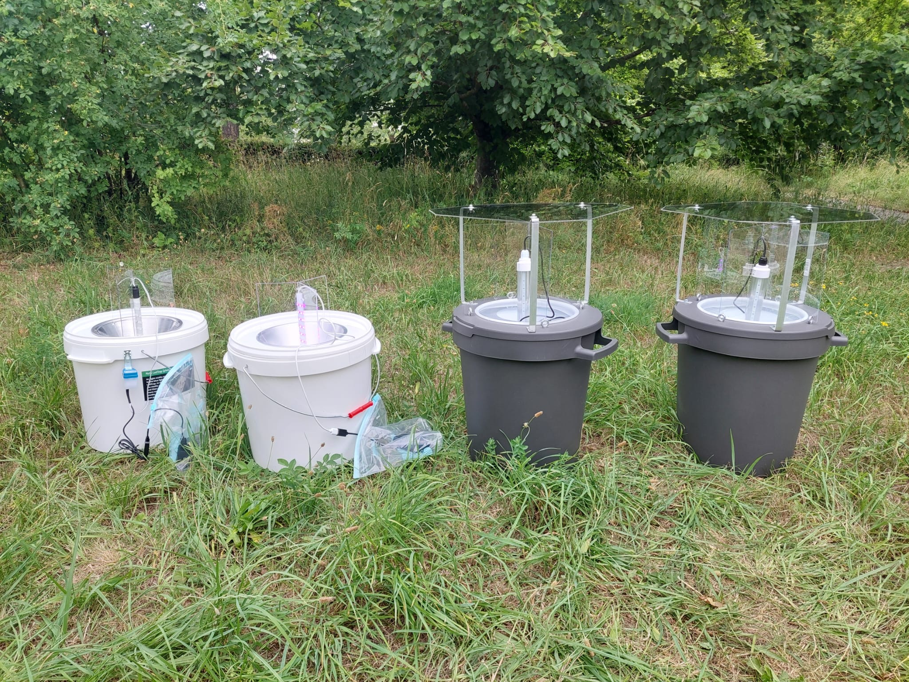
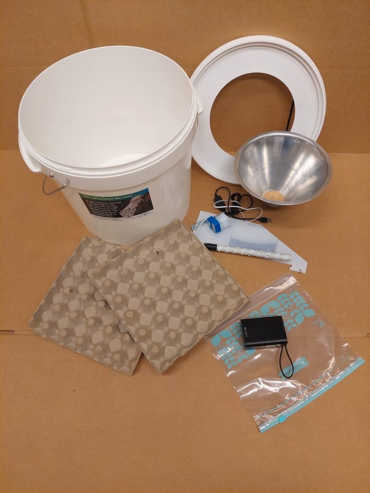
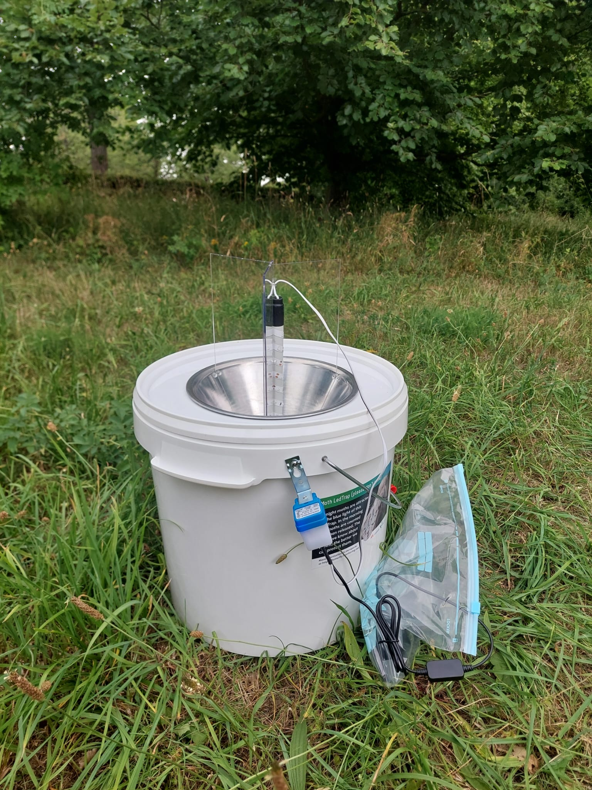
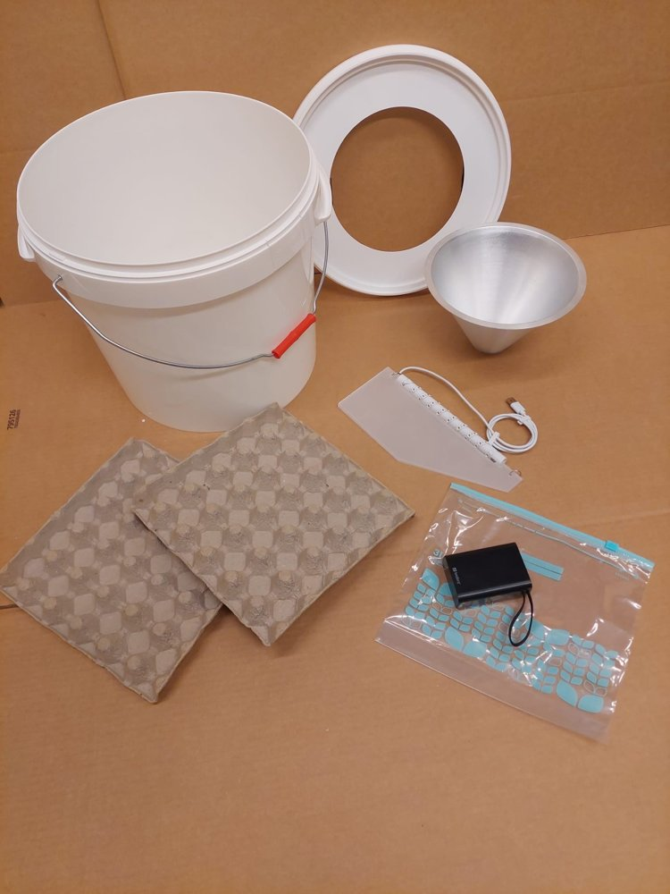
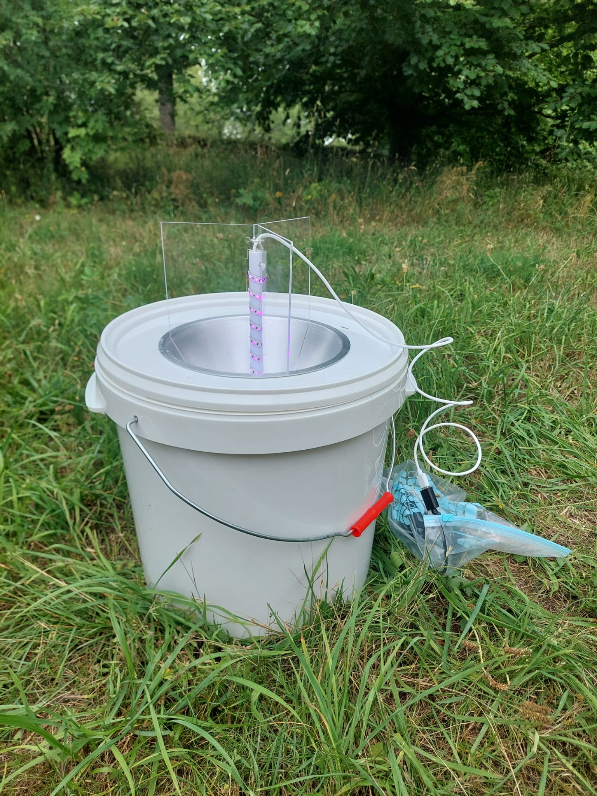
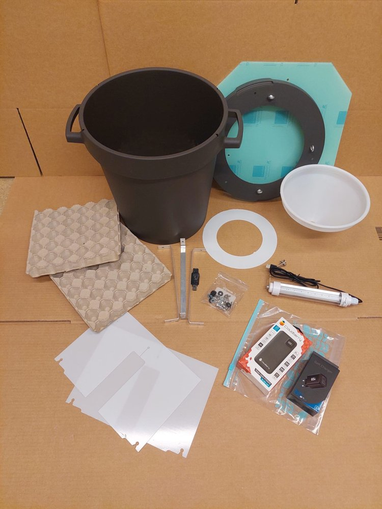
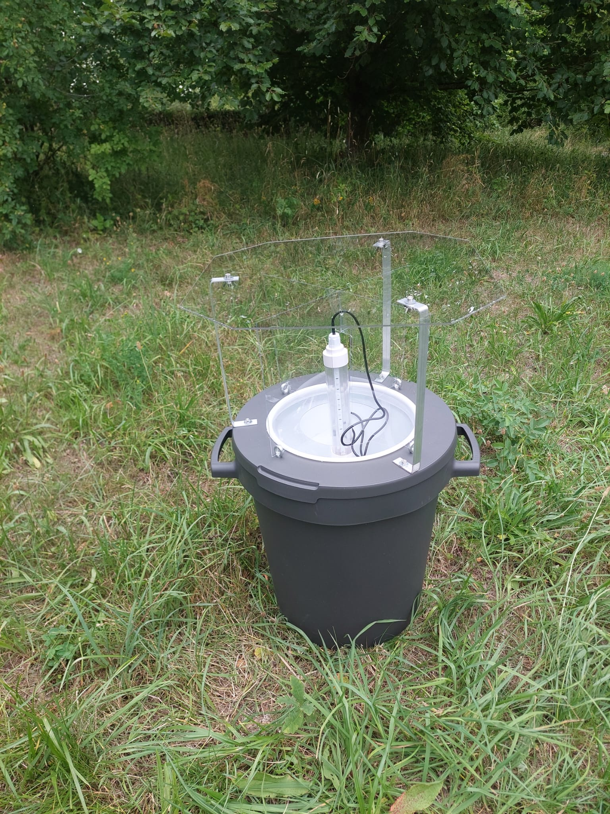
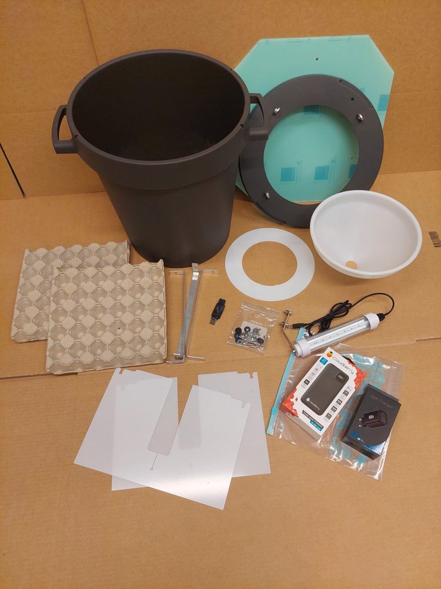
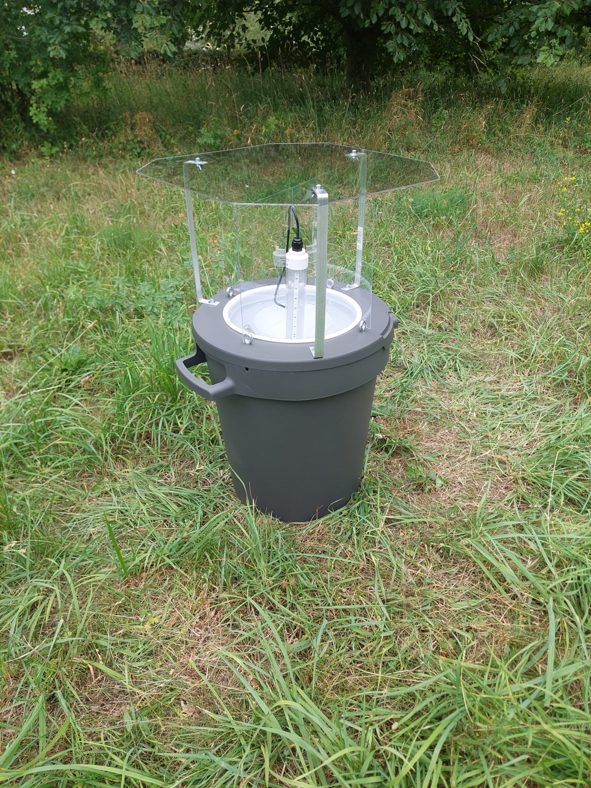

# Trap types

In this pilot project, four different light-bucket traps are used. All work on the same principle: a UV/LED light source attracts moths, which then end up in a funnel and are collected in the bucket/container underneath. If you'd like to read more about how moths are attracted to light, there's a 2024 article that worked it out using high-speed video (Fabian et al. 2024, available via [Nature Communications](https://www.nature.com/articles/s41467-024-44785-3)).

At your site in the gradient project, all four models are used at the same time, placed at their own trap position within the site. Which trap type ends up at which position is decided by drawing lots (see [Deploying traps: gradient](../hur-du-satter-ut/gradient-lund-abisko.md)).

## 1. LED-Emmer (standard)

- **Manufacturer**: De Vlinderstichting, Netherlands
- **Light**: UV 395 nm & 405 nm, 1.6 W
- **Container**: white bucket with a small transparent lid
- **Registered as**: `Type > LED > Ledstrip > 395-405 SMD 2835`

**Contents of the box**:

- 1 bucket, 1 lid
- 1 metal funnel
- 2 egg-carton pieces
- 1 light module with 3 wings as a stand
- 1 powerbank
- 1 USBa (male) to USBc (male) cable
- 1 plastic bag

  <iframe
    src="https://www.youtube.com/embed/5JjvBHtwObg?cc_load_policy=1&cc_lang_pref=en"
    title="Assembly: LED-Emmer | Pilotprojekt nattfjärilar 2026"
    frameborder="0"
    referrerpolicy="strict-origin-when-cross-origin"
    allow="accelerometer; autoplay; clipboard-write; encrypted-media; gyroscope; picture-in-picture"
    allowfullscreen>
  </iframe>

**Grid-section variant**: a closely related model from Veldshop is used in the grid section (not the gradient section). Same UV specification as above, but it lacks a light sensor and has minor differences in funnel, lid, and light-module shape. Still registered as **LED-Emmer (standard)**, since the UV specification is identical. See [Grid (Lund and Uppsala)](rutnat-lund-uppsala.md) for details.

## 2. LED-Emmer 2.0 Quad (upgraded)

- **Manufacturer**: Veldshop, Netherlands
- **Light**: UV 395 nm & 405 nm, 6 W (4x the brightness of the standard model)
- **Container**: same type of white bucket as the standard model
- **Important**: has **no light sensor** and stays lit continuously (the Dutch developers have found that light sensors are often a source of failure, so they've been removed on this model). Make sure the powerbank (Sandberg) is fully charged. A fully charged 20,000 mAh Sandberg normally lasts about 12.5 hours with the Quad module, but it may use more on the first few occasions before the powerbank has "settled" at full capacity.
- **Registered as**: `Type > LED > Other > "395-405 Quad"`

**Contents of the box**:

- 1 bucket, 1 lid
- 1 metal funnel
- 2 egg-carton pieces
- 1 light module with 3 wings as a stand
- 1 powerbank
- 1 USBa (male) to USBc (male) cable
- 1 USBc (male) to USBa (female) cable
- 1 plastic bag
- 1 card with 6 self-adhesive silicone dots

  <iframe
    src="https://www.youtube.com/embed/KGVXMc3BJPg?cc_load_policy=1&cc_lang_pref=en"
    title="Assembly: LED-Emmer Quad | Pilotprojekt nattfjärilar 2026"
    frameborder="0"
    referrerpolicy="strict-origin-when-cross-origin"
    allow="accelerometer; autoplay; clipboard-write; encrypted-media; gyroscope; picture-in-picture"
    allowfullscreen>
  </iframe>

**Note:** the LED-Emmer Quad funnel also needs small silicone dots fitted on the inside before it's assembled. See the video below:

  <iframe
    src="https://www.youtube.com/embed/Tq-d2nS3o_Q?cc_load_policy=1&cc_lang_pref=en"
    title="LED-Emmer Quad Funnels | Pilotprojekt nattfjärilar 2026"
    frameborder="0"
    referrerpolicy="strict-origin-when-cross-origin"
    allow="accelerometer; autoplay; clipboard-write; encrypted-media; gyroscope; picture-in-picture"
    allowfullscreen>
  </iframe>

## 3. EntoLight Twincolor

- **Manufacturer**: EntoLight, Finland
- **Light**: UV 365 nm & 395 nm, 7 W
- **Container**: larger dark tub with a wider, hexagonal transparent lid
- **Important**: lighter construction than the Dutch models — consider adding a stone or something else heavy to the bucket so it doesn't blow over.
- **Registered as**: `Type > LED > Other > "Entolight Twincolor"`

**Contents of the box**:

- 1 bucket, 1 lid
- 1 plastic funnel, 1 plastic disc
- 1 light module, 1 light sensor
- 1 bag with screws x6, spacers (black x6, metal x6), wing nuts x6
- 3 metal pieces
- 2 U-shaped plastic panels, 1 octagonal plastic panel
- 2 egg-carton pieces
- 1 powerbank, 1 adapter
- 1 plastic bag

  <iframe
    src="https://www.youtube.com/embed/QI6Ho9qigdY?cc_load_policy=1&cc_lang_pref=en"
    title="Assembly: EntoLight (Twincolor & Multicolor) | Pilotprojekt nattfjärilar 2026"
    frameborder="0"
    referrerpolicy="strict-origin-when-cross-origin"
    allow="accelerometer; autoplay; clipboard-write; encrypted-media; gyroscope; picture-in-picture"
    allowfullscreen>
  </iframe>

## 4. EntoLight Multicolor

- **Manufacturer**: EntoLight, Finland
- **Light**: UV 365 nm, UV 395 nm, 520 nm (green), 6500K (cool white), 7 W
- **Container**: same type of tub as the Twincolor
- **Important**: same weight reminder as the Twincolor.
- **Registered as**: `Type > LED > Other > "Entolight Multicolor"`

**Contents of the box**: same as the Twincolor (see above).

*Assembly video: see the Twincolor above — assembly is identical.*

## Powerbank troubleshooting (mainly relevant for the Quad module)

- If the powerbank (Sandberg) has shut itself down: wake it via the USBa-to-USBc cable that came in the powerbank's box, connect something that's charging (a phone or similar), or the light module with the light sensor covered (shield it with your hand).
- **Never** press the powerbank's power button — just unplug the cable, otherwise you'll need to wake it up again.
- If the Quad module doesn't start via USBa: try USBc instead, it can draw more current than USBa can supply.

  <iframe
    src="https://www.youtube.com/embed/qp0osTlcAnk?cc_load_policy=1&cc_lang_pref=en"
    title="Solve power bank issues | Pilotprojekt nattfjärilar 2026"
    frameborder="0"
    referrerpolicy="strict-origin-when-cross-origin"
    allow="accelerometer; autoplay; clipboard-write; encrypted-media; gyroscope; picture-in-picture"
    allowfullscreen>
  </iframe>

