# How to use the app: step by step

*The screenshots below are taken from the earlier field instructions (Arnberg & Pettersson 2026, available via the LU Research Portal) and show the basic flow in ButterflyCount. The layout may differ slightly from the latest app version, but the steps are the same.*

## Installation and initial setup

**Step 1**: Open the app, go to Menu.

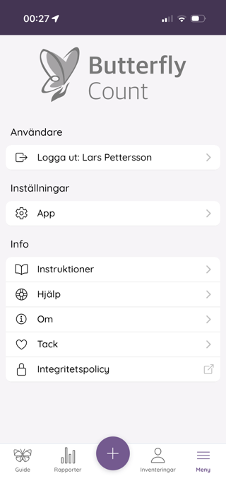

**Step 2**: Under Settings, choose Species Lists.

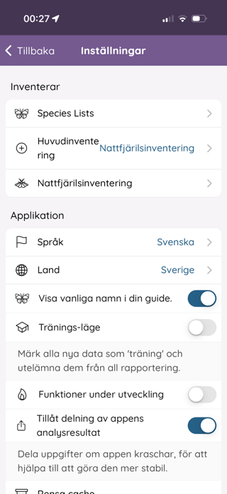

**Step 3**: Download the species lists Sweden and EBMS moths.

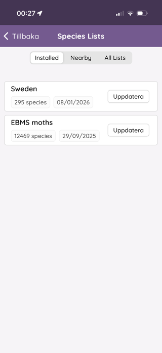

## Register a trap emptying

**Step 1**: Choose Moth survey on the home screen.

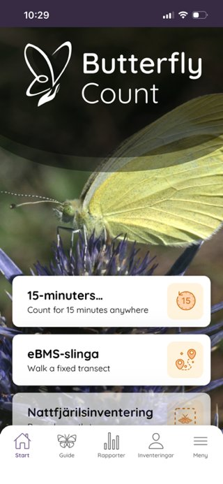

**Step 2**: Check that it says "Moth trap" on the top row, tap to choose your site.

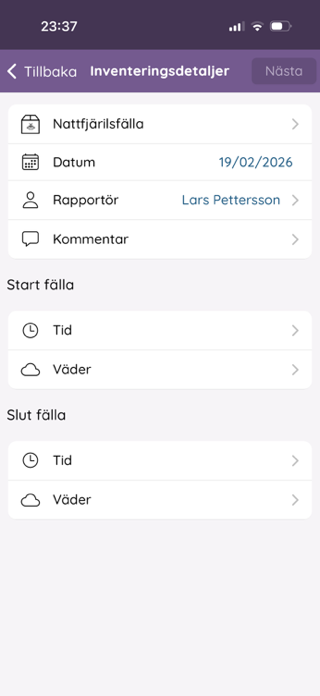

**Step 3**: Choose your site from the list.

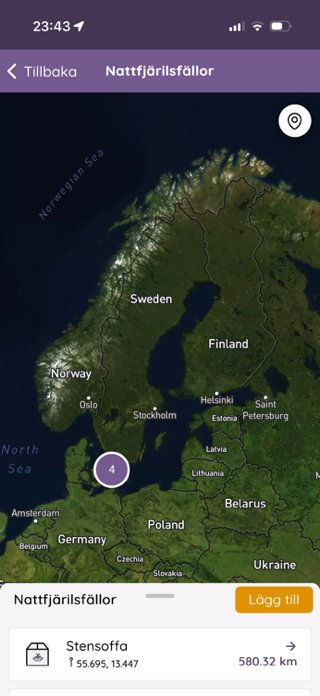

**Step 4**: Date and reporter are pre-filled but can be changed. Add a comment and weather if you like.

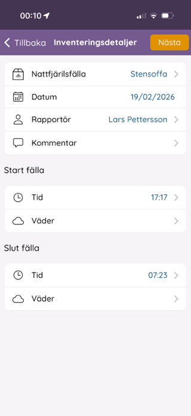

**Step 5**: Add a species, either by text search or by photo.

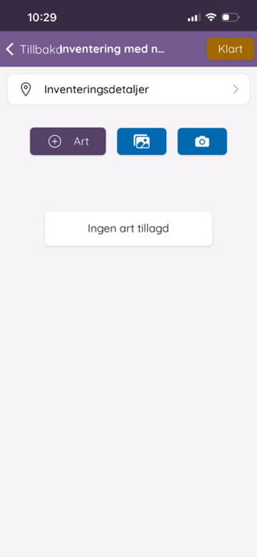

**Step 6**: Type a few letters to get suggestions — both Swedish and scientific names work.

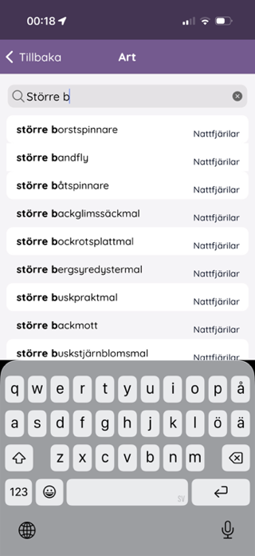

## Photographing several moths at once

**Step 1**: Choose photos from the gallery — can be done for several animals at the same time.

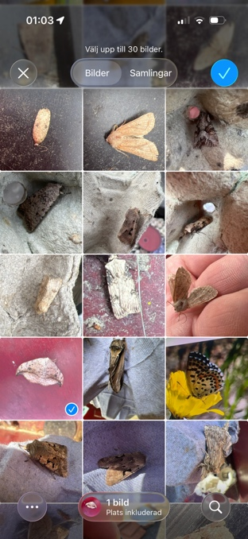

**Step 2**: The classifier processes the photos; some end up as "Unknown" if it's uncertain.

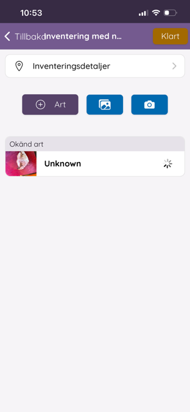

**Step 3**: Tap an observation to see/change the species identification.

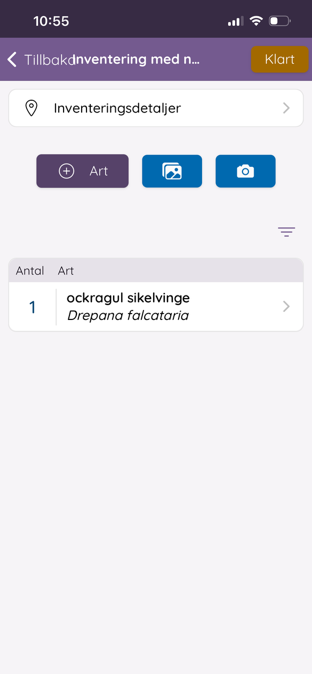

**Step 4**: Under Edit occurrence, adjust the count inside/outside the trap and see how confident the classifier was.

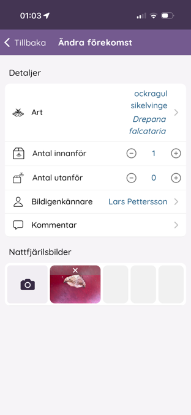

Once you've registered all the moths at the trap: tap **Done** and **Upload**.

## If you get stuck

If the app loses its place and ends up back at Survey details, go to Back and then Surveys — your started report is still there and can be continued.

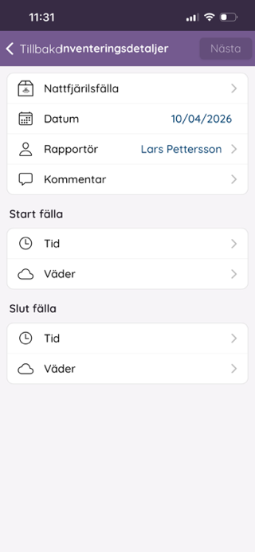

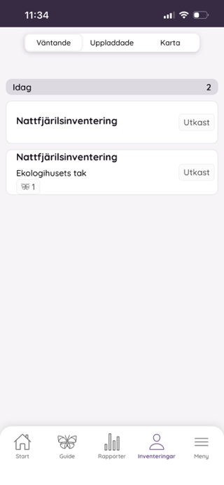

See also [What should be reported](vad-som-raknas.md) and [Editing observations](andra-observationer.md).

---

*Did you run into a technical problem in the app or on the website that isn't covered here? See [Report a technical issue](../kontakt-och-stod/rapportera-tekniskt-fel.md) for how to proceed.*
