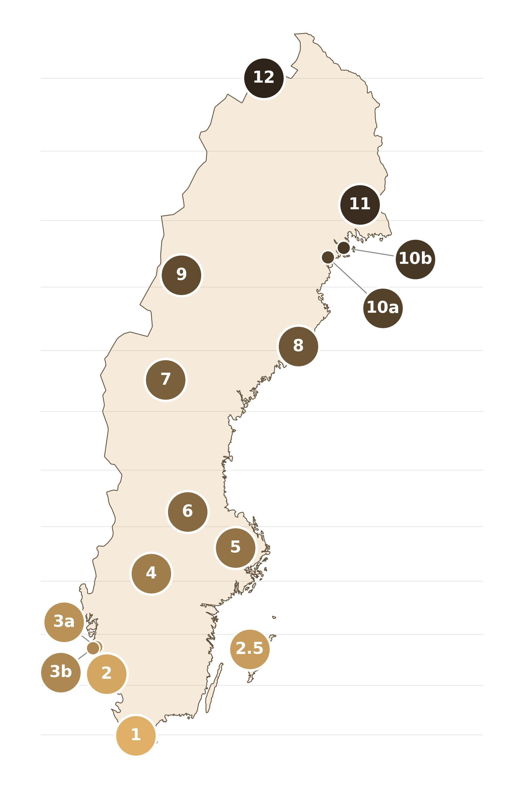

# Gradient (Lund-Abisko)

The gradient part is the pilot project's main component: 15 sites along a north-south stretch from Lund to Abisko, with four different trap types (see [Trap types](../falltyper/oversikt.md)) tested in parallel at every site.

## What applies if you're taking part in the gradient section

- See [General principles for trap site selection and allocation](site-specifikationer.md) for how traps are placed and were assigned to your site
- Sampling happens **once a week** — see [Weekly routine](../../under-experimentet/vecko-rutin.md) for when to start and practical details, including any pauses during light nights at northern sites
- All four trap types must be registered separately in the app/on the website, see [Register your trap](../hur-du-rapporterar/registrera-falla.md)

## The sites

The 12 main sites are distributed along the gradient at roughly equal intervals of latitude. In addition, there are three supplementary sites with specific purposes:

| No. | Site | Note |
|---|---|---|
| 1 | Revinge | |
| 2 | Varberg | |
| 2.5 | Gotlands Tofta | Island site (see below) |
| 3a | Torslanda | |
| 3b | Grötö | Island site (see below) |
| 4 | Kristinehamn | |
| 5 | Uppsala | |
| 6 | Falun | |
| 7 | Torråsen | |
| 8 | Umeå | |
| 9 | Marsfjäll | Summer light pause (see below) |
| 10a | Norrfjärden | NAT-PoMS comparison; light pause (see below) |
| 10b | Luleå | Summer light pause (see below) |
| 11 | Överkalix | Summer light pause (see below) |
| 12 | Abisko | Summer light pause (see below) |

### The three supplementary sites

**Gotlands Tofta (2.5) and Grötö (3b)** represent island habitats. Islands come with particular conditions for moths: limited populations, possible isolation effects, and a microclimate that differs from the mainland. Wind, in particular, can be a challenge for surveying with light-bucket traps in coastal environments. These sites let us investigate how well the traps capture these differences.

**Norrfjärden (10a)** connects the gradient project to the national pilot study NAT-PoMS, which tested pollinator monitoring in different parts of Sweden in 2021–2022. Moth data in NAT-PoMS was collected here in 2022. The results from 2026 will make it possible to directly compare with the results from that work — see Arnberg et al. (2024), [Pilot study for general pollinator monitoring](https://portal.research.lu.se/en/publications/pilotf%C3%B6rs%C3%B6k-f%C3%B6r-generell-%C3%B6vervakning-av-pollinat%C3%B6rer-resultat-f%C3%B6r-2/) and the EU project [SPRING](https://data.europa.eu/doi/10.2779/7978371).

## Why this gradient?

### Light conditions and latitude

The primary reason for extending the gradient all the way to Abisko is to investigate how summer light conditions affect catch results. Further north, the summer night shortens quickly — and at sufficiently high latitudes, astronomical twilight disappears entirely for a period in the middle of summer. Light traps simply don't work when the night isn't dark enough to attract moths.

Even as far south as Dalarna, this effect can become noticeable during the lightest parts of the summer night. For the project's five northernmost sites (Marsfjäll and further north), this means several sampling occasions become voluntary during part of the summer, when calculated light conditions aren't yet good enough for light-based moth catching. As a complement, though, you're always welcome to test even earlier than the suggested first date — all data is welcome!

### Catch efficiency and workload

There's also a practical dimension. The four trap models differ in brightness and spectral composition — the Finnish EntoLight models are powerful and can potentially attract significantly more individuals. In southern Sweden, with high species richness and abundant moth populations, this risks producing more moths per emptying than is reasonable to handle alone.

Further north, where the season is shorter and catch volumes generally lower, that extra capacity can be a real asset. The gradient makes it possible to test this in practice and helps establish realistic workload limits ahead of future national monitoring.

## Light pause at northern sites

Five of the project's sites are far enough north that the summer night disappears completely for a period. During these weeks, traps should not be put out. The table below shows calculated pause periods based on astronomical twilight, calibrated against field observations from Norrfjärden (see [Calculating the light pause](ljusberakningar.md) for the calculation method).

| Site | Traps close | Traps reopen | Pause |
|---|---|---|---|
| Marsfjäll (9) | 3 June | 11 July | 38 days |
| Norrfjärden (10a) | 1 June | 13 July | 42 days |
| Luleå (10b) | 30 May | 15 July | 46 days |
| Överkalix (11) | 26 May | 19 July | 54 days |
| Abisko (12) | 16 May | 29 July | 74 days |

Sites 1–8 (Revinge–Umeå) have no light restrictions and can be sampled for the whole season.

## About the selection

With only 15 sites in total, every site's data matters. Our aim has been to distribute sites evenly across the country's latitudes, plus supplement with a few additional sites. With such a large span of latitudes and such varied habitat types, the fixed placement of traps at each site is important.

Four trap positions are chosen in advance, all as equivalent as possible. Which trap goes where is then decided by lot. The approach of examining 15 sites with fixed trap placement is central to the study design — rearranging things partway through the season would undermine the ability to compare trap types fairly (see [General principles](site-specifikationer.md)).
