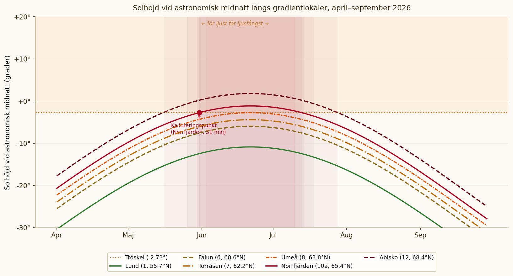

# Background light interference and sampling conditions

This page explains how we define and calculate when background light interference at night becomes strong enough that light-based moth traps no longer work satisfactorily — and when sampling can resume. It's aimed at those who want to understand the background; it's enough to follow the table on the [gradient page](gradient-lund-abisko.md) if you just need to know which periods apply to your site.

## The problem: background light varies with latitude and season

Light traps for moths rely on the trap's UV light standing out against a dark background. The brighter the night, the weaker the contrast, and the worse the capture efficiency. This isn't a problem in southern Sweden, where summer nights are still dark enough regardless, but along a gradient up to Abisko the effect becomes noticeable: at sufficiently high latitudes, astronomical twilight disappears entirely for a period around midsummer.

To be able to compare catches fairly along the gradient — and ahead of future national monitoring — we need a standardised, principled definition of when background light interference becomes significant. That's the definition presented here.

## Solar elevation at astronomical midnight

The intensity of background light at night depends on the sun's position below the horizon. The relevant measure is the **solar elevation at astronomical midnight** — the point in the day when the sun is at its lowest.

The sun's declination (δ), meaning how far the sun is north or south of the equatorial plane, varies sinusoidally over the year:

> δ = −23.44° × cos(2π(N + 10) / 365)

where N is the day of the year (1 = 1 January). The maximum +23.44° is reached at midsummer, the minimum −23.44° at midwinter.

The solar elevation at astronomical midnight for a given latitude (φ) is given by:

> h = δ + φ − 90°

Negative values mean the sun is below the horizon. The more negative h is, the darker the night, and the better the conditions for light traps.

## The threshold: what counts as background light interference?

Where the line falls for background light interference can't be determined purely astronomically — it depends on how moths actually respond to the light conditions. Instead, we've calibrated the threshold against field observations.

One of the project's participants carried out light trapping at **Norrfjärden (65.42°N)** over a number of seasons. Their experience was that the traps gave meaningful results up to and including **31 May**, but that background light interference at night around midsummer was too strong for satisfactory catches. The date sampling was judged to be able to **resume** was **1 August**.

31 May gives a calculated h-value of **−2.73°** at Norrfjärden's latitude, which is used as the project's threshold for background light interference. Sampling is recommended when h ≤ −2.73°; if h is higher than that, background light interference is considered too strong for comparable results.

## Diagram

The figure below shows the solar elevation at astronomical midnight for a selection of the project's sites during April–September 2026. Periods where the curve exceeds the threshold (orange dashed line) are periods with background light interference.

Sites south of roughly 65°N — from Revinge to Umeå — stay below the threshold for the whole season. For the five northernmost sites, the threshold is exceeded for a period around midsummer.

## Periods with background light interference

The table below shows the calculated periods of background light interference for the project's northernmost sites, based on the threshold h = −2.73°.

| Site | Interference from | Sampling can resume | Number of days |
|---|---|---|---|
| Marsfjäll (9) | 3 June | 11 July | 38 days |
| Norrfjärden (10a) | 1 June | 13 July | 42 days |
| Luleå (10b) | 30 May | 15 July | 46 days |
| Överkalix (11) | 26 May | 19 July | 54 days |
| Abisko (12) | 16 May | 29 July | 74 days |

Sites 1–8 (Revinge–Umeå) have no periods of background light interference and can be sampled for the whole season.

## Uncertainty and limitations

**Asymmetry in the calibration.** Field observations suggest sampling stopped working around 31 May and could resume around 1 August. The two dates don't give exactly the same threshold value — 31 May gives h = −2.73°, while 1 August gives a somewhat lower value (~−6.7°). The difference is likely because the traps weren't actively tested in the period closest to midsummer. The more conservative value (31 May) is used, which gives shorter periods of background light interference rather than longer ones.

**Local variation.** Cloud cover, topography, and local light pollution can shift the boundary in either direction. The calculations concern astronomical conditions, not actual weather conditions.

**Early sampling attempts are welcome.** Observations from northern sites near the boundary dates of these periods are valuable and help calibrate the threshold for future seasons.

## External resources

- [SMHI's Sun Wheel](https://www.smhi.se/kunskapsbanken/meteorologi/sol-och-mane/soluret-1.3798) — information on sunrise and sunset in Sweden
- [timeanddate.com](https://www.timeanddate.com/sun/sweden/) — interactive sun calculator with exact times for any location and date
- [Lund Observatory](https://www.astro.lu.se/) — astronomical reference data

---

*The calculations on this page can be reproduced with the sinusoidal solar-declination model above. For higher precision, packages such as [PyEphem](https://rhodesmill.org/pyephem/) (Python) can be used, which calculate the sun's position more precisely and account for how the atmosphere bends light near the horizon.*
