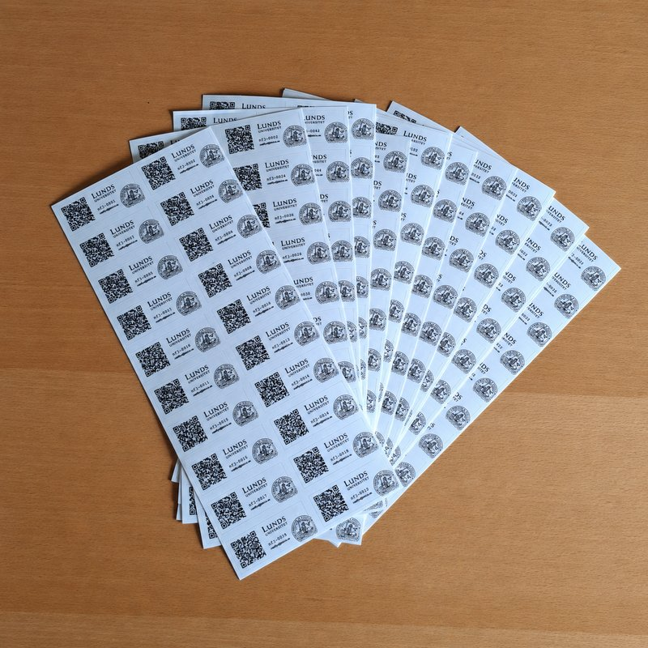

# QR codes for the equipment

The project got off to a fast start this summer, and we prioritised getting the equipment out to all of you. Unfortunately, that means we need to ask for your help labelling traps, light modules, and powerbanks as a dedicated campaign in August. As a thank you for your help, a small surprise gift will be sent by post. More details to follow.

## What you'll receive

Two sheets will be sent out:

- Two sheets of numbered QR codes (stickers, see above)
- A list showing which number corresponds to which unit

The codes for the light modules come on small stickers, while the codes for the traps and powerbanks are on slightly larger ones.

## How to attach the labels

We'll follow up with photos of the smaller light-module stickers as soon as we receive them, along with a short instructional video showing exactly where on each unit the label should go.

## Checking that the right label is on the right unit

If you'd like to double-check that a label has ended up on the right unit, you can scan the QR code with your phone. This will bring up information about the unit, for example:

> **Device information**
> **Device ID:** nfj-0001
> **Device type:** light trap
> **Manufacturer:** EntoLight
> **Model:** Twincolor LED funnel trap (7 W light module) + photocell controller + GaN charger (65 W)

## Why QR codes?

The information from the QR code makes it possible to see exactly which unit is in front of you. This gives us an easy, consolidated overview of the equipment in use out in the field.
