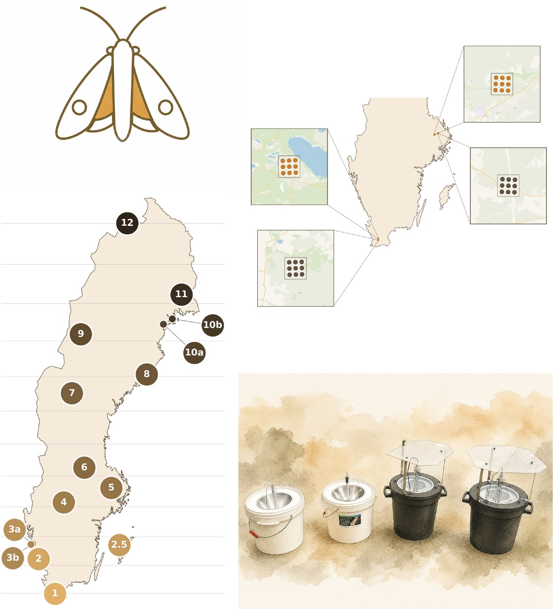

Welcome to the manual for the 2026 pilot project. This page shows you where to find what you need, depending on which part of the project you're taking part in.

*Produced by Lars B. Pettersson, Department of Biology, Lund University, with contributions from Harriet Arnberg, Amanda Ernstsson, and Ana Teodora Ştefan. [About this manual and the project](om-manualen.md)*

## Why are we doing this?

Moths are important pollinators, but we know surprisingly little about how their populations are faring over time. EU member states are now starting to regularly monitor four different pollinator groups, and moths are one of them. Before Sweden can get properly under way, we need to answer a few practical questions — it has been decided that they will be surveyed using light traps, but which type of trap works best? How strong does the light need to be? Where in the landscape should the traps be placed? That's exactly what this pilot project aims to find out during 2026, ahead of monitoring starting in earnest from 2027.

Read more about the project in [Background](bakgrund/bakgrund.md), including why we use these particular digital tools.

## Which part of the project are you involved in?

- **Landscape effects (Lund/Uppsala)**: you manage a grid of 3 x 3 live traps for moths, so-called light buckets, within 1 x 1 km landscape squares. The traps are the Dutch standard model LED-Emmer, but version 2.0 from Veldshop. Go to [Deploying traps: grid](hur-du-satter-ut/rutnat-lund-uppsala.md).
- **Latitude gradient (Lund-Abisko)**: you manage one of the 15 gradient sites, where all four trap models are tested in parallel at their own trap position within the site. Sampling happens once a week. Go to [Deploying traps: gradient](hur-du-satter-ut/gradient-lund-abisko.md).

See also [General principles for trap site selection and allocation](hur-du-satter-ut/site-specifikationer.md), [Trap types](falltyper/oversikt.md), and [QR codes for the equipment](hur-du-satter-ut/qr-koder-utrustning.md).

## During the season

Once you're up and running, see [Weekly routine: putting out, emptying, reporting](under-experimentet/vecko-rutin.md) for the ongoing work.

## How to report

- [Register your trap](hur-du-rapporterar/registrera-falla.md)
- [How to use the app](hur-du-rapporterar/app-instrux.md)
- [What should be reported](hur-du-rapporterar/vad-som-raknas.md)
- [Editing observations afterwards](hur-du-rapporterar/andra-observationer.md)

## After reporting

- [Validation](efter-inrapportering/validering.md)
- [What happens to your data?](efter-inrapportering/forvantade-resultat.md)

## Give feedback

You can give feedback and suggestions on an ongoing basis on [the page for comments and suggestions](kontakt-och-stod/synpunkter.md)

## Consent: sharing of contact details

We will partly send out information via newsletter and email — if you don't want your email address to be visible there, just let us know at [nattflyn@gmail.com](mailto:nattflyn@gmail.com). To make it possible to quickly exchange experiences and get help with support, we will also have a WhatsApp group, but participation there is voluntary. Your contact details may therefore be shared with other participants in the project via these two channels, but your email can be anonymised and the WhatsApp group is optional.

## Contact and support

Questions about method, placement, the WhatsApp group, or similar — see [Contact and support](kontakt-och-stod/whatsapp-och-kontakt.md).

---

**Current version**: {{ site.version }} — {{ site.version_date }} · This manual is updated on an ongoing basis, see also [News and experiences](kontakt-och-stod/nyheter.md) · For an overview of the manual, see [All pages](alla-sidor.md) · [About this manual](om-manualen.md)

📄 [Download the manual as PDF](../assets/pdf/nattfjarilar-manual-en.pdf) — a print-friendly snapshot of the page. Video links are shown as clickable addresses instead of embedded players, and some of the layout (page breaks, image sizes) is a compromise between how it looks online and the ability to print it.
