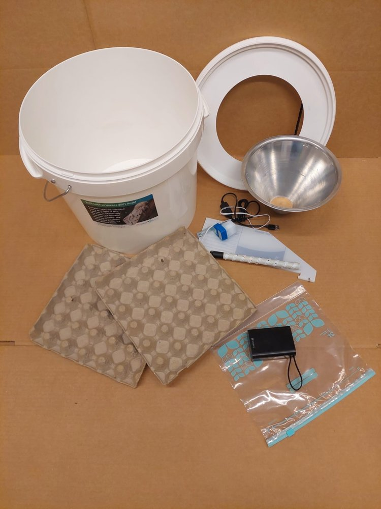
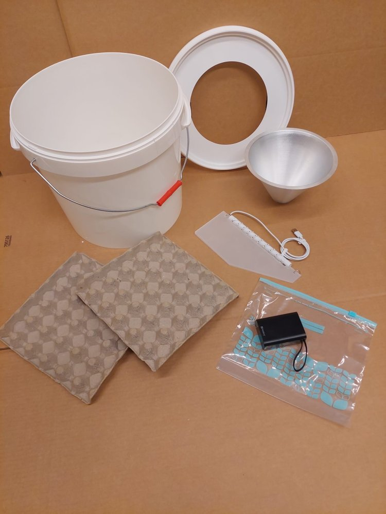
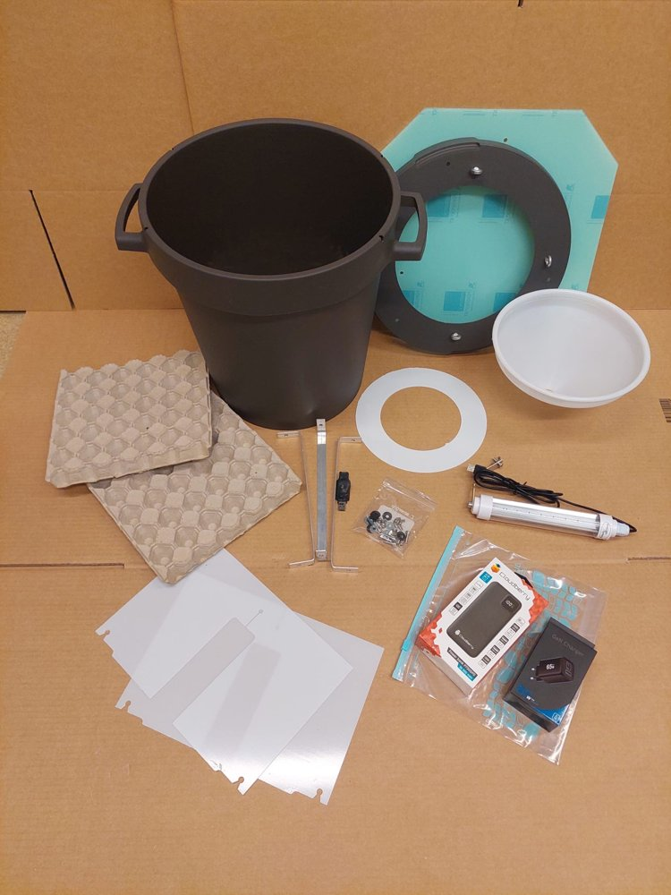
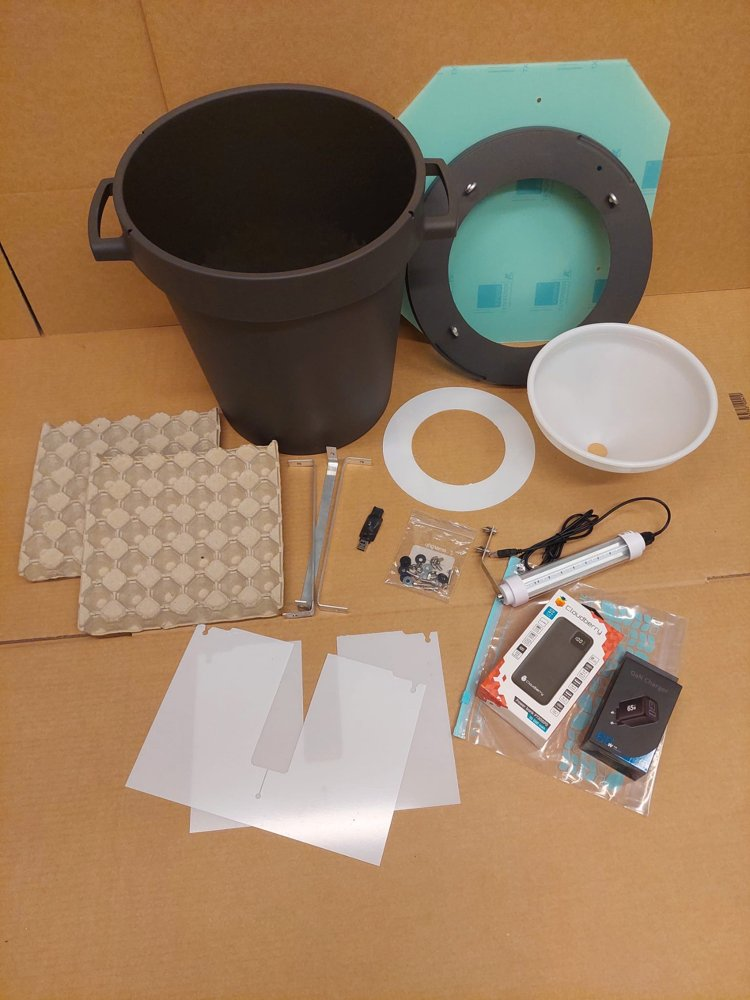

# Fälltyper

I det här pilotprojektet används fyra olika ljushinkar. Alla fungerar enligt samma princip: en UV/LED-ljuskälla lockar till sig nattfjärilar, som sedan hamnar i en tratt och samlas i hinken/kärlet undertill. På din lokal i gradientprojektet får du en av dessa fyra, tilldelad genom lottning (se [Sätta ut fällor: gradient](../hur-du-satter-ut/gradient-lund-abisko.md)).

## 1. LED-Emmer (standard)

- **Tillverkare**: De Vlinderstichting, Nederländerna
- **Ljus**: UV 395 nm & 405 nm, 1,6 W
- **Kärl**: vit hink med litet genomskinligt tak
- **Registreras som**: `Typ > LED > Ledstrip > 395-405 SMD 2835`

**Innehåll i lådan**:

- 1 hink, 1 lock
- 1 metalltratt
- 2 äggkartongbitar
- 1 ljusmodul med 3 vingar som ställning
- 1 powerbank
- 1 USBa (hane) till USBc (hane)-sladd
- 1 plastpåse

**Variant i rutnätsdelen**: en näraliknande modell från Veldshop används i rutnätsdelen (ej gradientdelen). Samma UV-specifikation som ovan, men saknar ljussensor, med mindre skillnader i tratt-, lock- och ljusmodulform. Registreras ändå som **LED-Emmer (standard)** eftersom UV-specifikationen är identisk. Se [Rutnät (Lund och Uppsala)](../hur-du-satter-ut/rutnat-lund-uppsala.md) för detaljer.

## 2. LED-Emmer 2.0 Quad (uppgraderad)

- **Tillverkare**: Veldshop, Nederländerna
- **Ljus**: UV 395 nm & 405 nm, 6 W (4x ljusstyrka jämfört med standardmodellen)
- **Kärl**: samma typ av vit hink som standardmodellen
- **Viktigt**: har **ingen ljussensor** och lyser kontinuerligt (de holländska utvecklarna har sett att ljussensorer ofta är en felkälla, så de har tagits bort på den här modellen). Se till att powerbanken (Sandberg) är fulladdad. En fulladdad 20 000 mAh Sandberg räcker normalt ca 12,5 timmar med Quad-modulen, men det kan gå åt mer de första gångerna innan powerbanken "stabiliserat sig" på full kapacitet.
- **Registreras som**: `Typ > LED > Other > "395-405 Quad"`

**Innehåll i lådan**:

- 1 hink, 1 lock
- 1 metalltratt
- 2 äggkartongbitar
- 1 ljusmodul med 3 vingar som ställning
- 1 powerbank
- 1 USBa (hane) till USBc (hane)-sladd
- 1 USBc (hane) till USBa (hona)-sladd
- 1 plastpåse

## 3. EntoLight Twincolor

- **Tillverkare**: EntoLight, Finland
- **Ljus**: UV 365 nm & 395 nm, 7 W
- **Kärl**: större mörk balja med bredare, sexkantigt genomskinligt tak
- **Viktigt**: lättare konstruktion än de holländska modellerna, lägg gärna i en sten eller något annat tungt i hinken så den inte blåser omkull.
- **Registreras som**: `Typ > LED > Other > "Entolight Twincolor"`

**Innehåll i lådan**:

- 1 hink, 1 lock
- 1 plasttratt, 1 plastcirkel
- 1 ljusmodul, 1 ljussensor
- 1 påse med skruvar x6, distansbrickor (svarta x6, metall x6), vingmuttrar x6
- 3 metallbitar
- 2 plastskivor, U-formade, 1 plastskiva oktagon
- 2 äggkartongbitar
- 1 powerbank, 1 adapter
- 1 plastpåse

## 4. EntoLight Multicolor

- **Tillverkare**: EntoLight, Finland
- **Ljus**: UV 365 nm, UV 395 nm, 520 nm (grönt), 6500K (kallvitt), 7 W
- **Kärl**: samma typ av balja som Twincolor
- **Viktigt**: samma viktpåminnelse som Twincolor.
- **Registreras som**: `Typ > LED > Other > "Entolight Multicolor"`

**Innehåll i lådan**: samma som Twincolor (se ovan).

## Powerbank-felsökning (gäller främst Quad-modulen)

- Om powerbanken (Sandberg) stängt ner sig: väck den via USBa-till-USBc-sladden som följde med i powerbankens kartong, koppla in något som laddar (mobil eller liknande) eller ljusmodulen med ljusreläet mörklagt (täck med handen).
- Klicka **aldrig** på powerbankens av-knapp, dra bara ur sladden, annars behöver du väcka den på nytt.
- Om Quad-modulen inte startar via USBa: prova USBc istället, den kan dra mer ström än vad USBa klarar av.

---

*Fler bilder och ev. korta videor för montering läggs till efter hand.*
