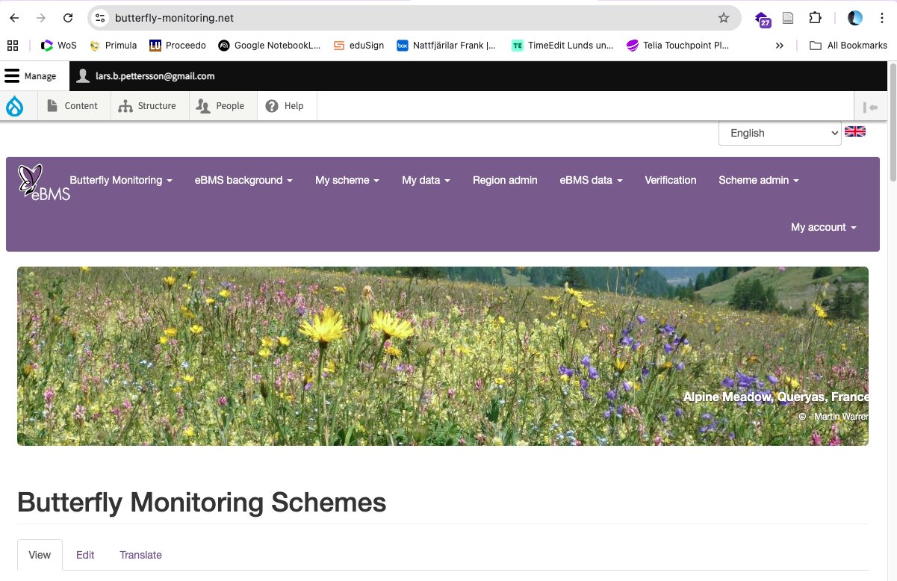
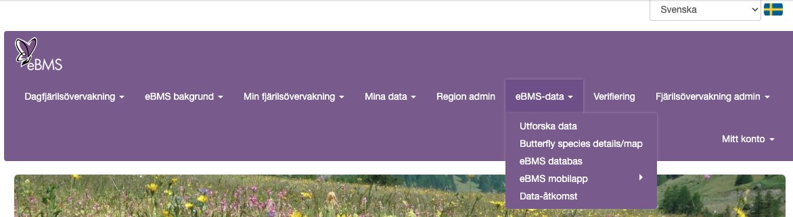
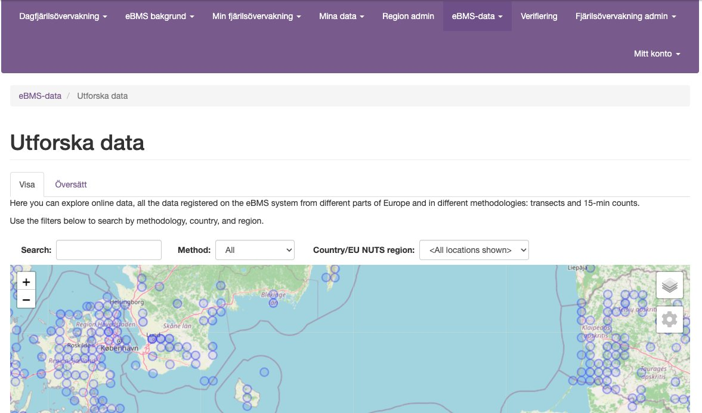

# Ändra en observation i efterhand

Observationer som du lagt in via appen ButterflyCount kan ändras både i appen och på hemsidan (butterfly-monitoring.net), oavsett var de ursprungligen registrerades. Samma inloggning används på båda ställena.

## I appen

Gå till inventeringen, öppna den art du vill justera under **Ändra förekomst**. Där kan du ändra:

- **Antal innanför** / **Antal utanför** fällan
- **Bildigenkännare** (vem som gjort bestämningen)
- **Kommentar**
- Lägga till fler bilder på samma art

## På hemsidan

Logga in på [butterfly-monitoring.net](https://butterfly-monitoring.net/) med samma uppgifter som i appen. Där kan du hitta din inventering (via kartan eller listan) och justera antal på samma sätt som i appen.

Du kan också bläddra bland alla svenska nattfjärilsobservationer (inklusive dina egna) under **eBMS-data → Utforska data**, filtrera på metod **Moth Trap** och land **Sweden** för att bara se nattfjärilsdata.

## Bra att veta

- Att kunna ändra i efterhand är just varför det är viktigt att **inte** registrera sig i training mode, se [Registrera fälla](registrera-falla.md).
- Fotograferar du samma djur två gånger räknas det som två exemplar, justera antalet manuellt om så behövs.
- Du kan ladda upp flera bilder i klump för en fälla, appens klassificerare artbestämmer dem efter hand.
- Appen kan (ännu) inte beskära bilder. Behöver du beskära, ta bilden med mobilkameran, beskär den, och ladda sedan upp den i appen.
- Är artbestämningen osäker, testa gärna [ObsIdentify](https://waarneming.nl/) som brukar vara pålitlig för en snabb kontroll.

## Export till Artportalen

Målet är att data ska kunna synkas automatiskt till Artportalen, men det kräver dels ditt samtycke, dels godkännande från Artdatabanken, vilket ännu inte är klart. Redan nu kan du dock alltid exportera din data och manuellt importera den till Artportalen om du vill ha den där också.
