# Så använder du appen: steg för steg

*Skärmbilderna nedan är hämtade från den tidigare fältinstruktionen (Arnberg & Pettersson 2026) och visar grundflödet i ButterflyCount. Layouten kan skilja sig något mot senaste appversionen, men stegen är desamma.*

## Installation och grundinställning

**Steg 1**: Öppna appen, gå till Meny.

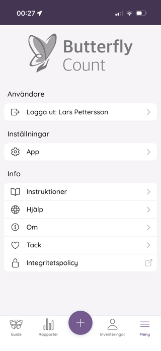

**Steg 2**: Under Inställningar, välj Species Lists.

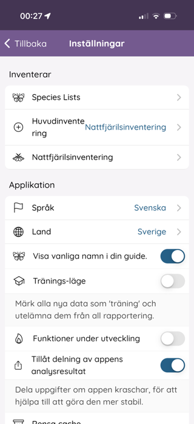

**Steg 3**: Ladda ner artlistorna Sweden och EBMS moths.

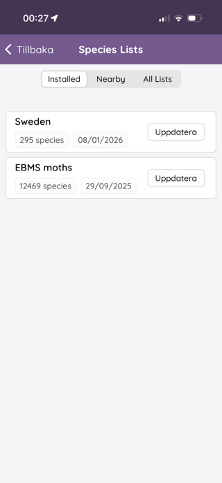

## Registrera en vittjning

**Steg 1**: Välj Nattfjärilsinventering på startsidan.

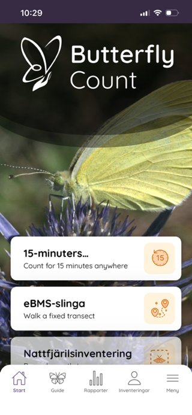

**Steg 2**: Kontrollera att det står "Nattfjärilsfälla" på översta raden, klicka för att välja lokal.

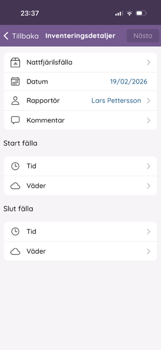

**Steg 3**: Välj din lokal i listan.

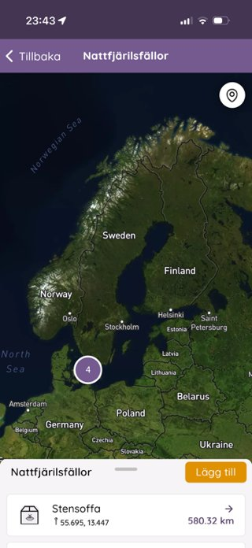

**Steg 4**: Datum och rapportör är förifyllda men kan ändras. Lägg till kommentar och väder om du vill.

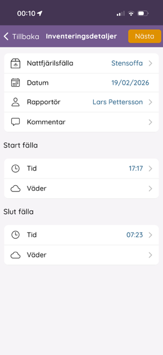

**Steg 5**: Lägg till art, antingen med textsökning eller genom foto.

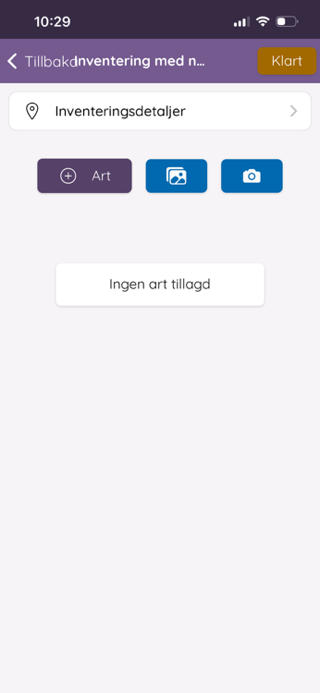

**Steg 6**: Skriv in några bokstäver för att få förslag, både svenska och vetenskapliga namn fungerar.

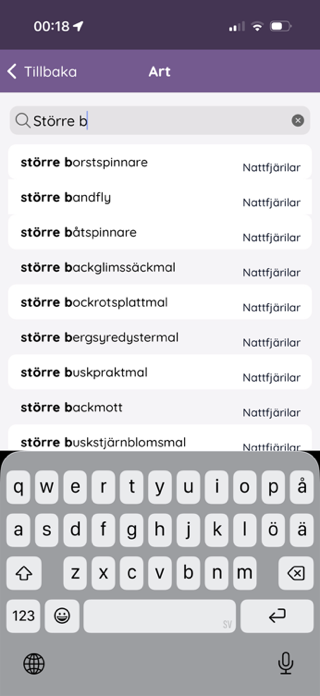

## Fotografera flera fjärilar i klump

**Steg 1**: Välj bilder från galleriet, kan göras för flera djur samtidigt.

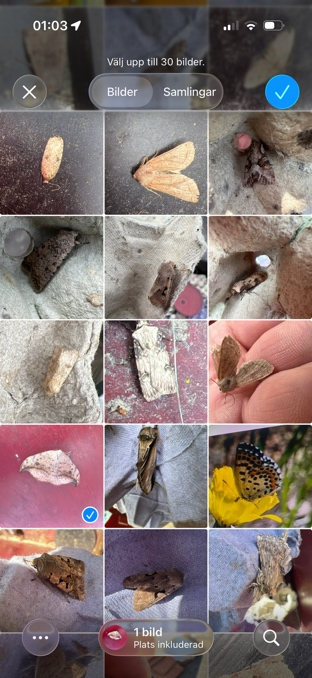

**Steg 2**: Klassificeraren behandlar bilderna, vissa hamnar som "Unknown" om den är osäker.

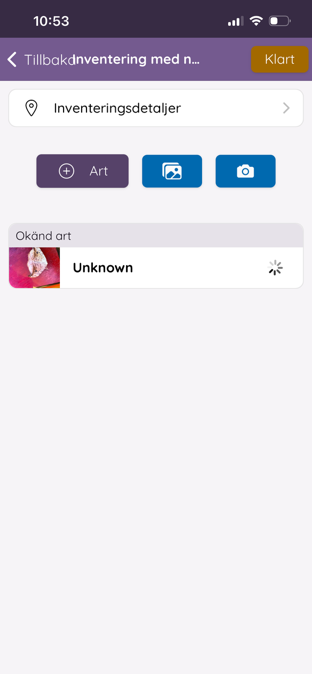

**Steg 3**: Klicka på en observation för att se/ändra artbestämningen.

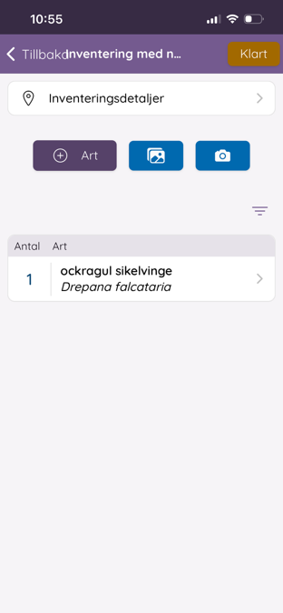

**Steg 4**: Under Ändra förekomst justerar du antal innanför/utanför fällan och kan se hur säker klassificeraren var.

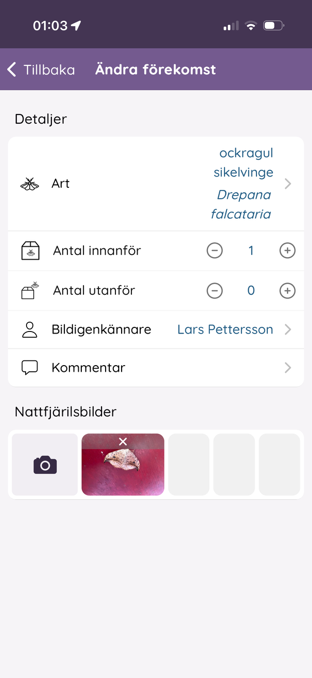

När du registrerat alla fjärilar vid fällan: tryck **Klart** och **Ladda upp**.

## Om du hamnar fel

Om appen tappar tråden och hamnar tillbaka på Inventeringsdetaljer, gå till Tillbaka och sedan Inventeringar, din påbörjade rapportering finns kvar där och går att fortsätta.

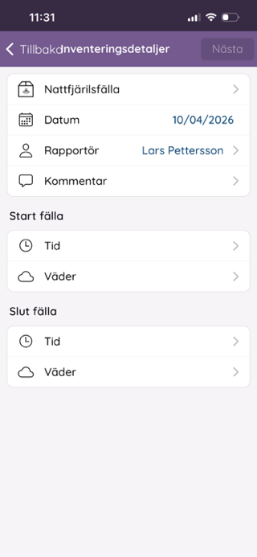

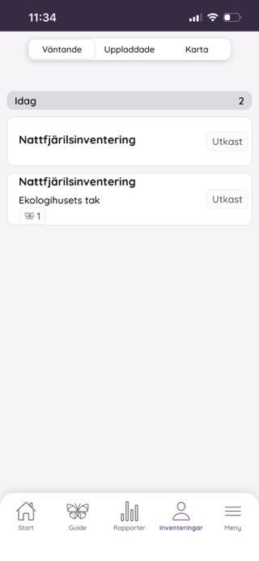

Se även [Vad som ska rapporteras](vad-som-raknas.md) och [Ändra observationer](andra-observationer.md).
