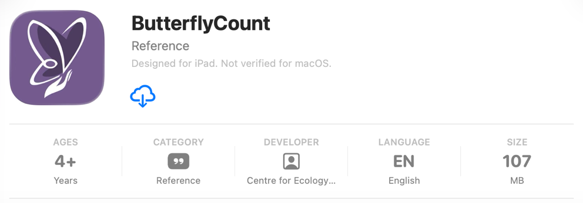
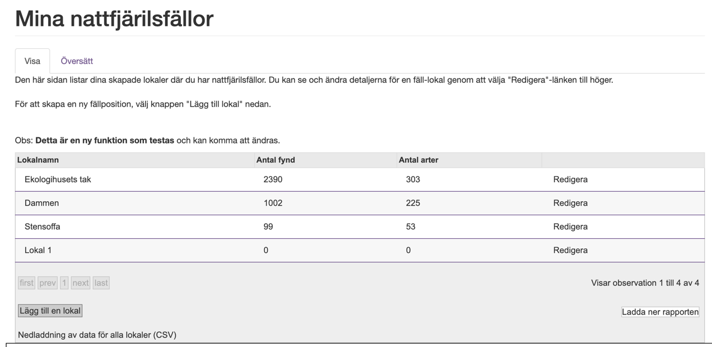
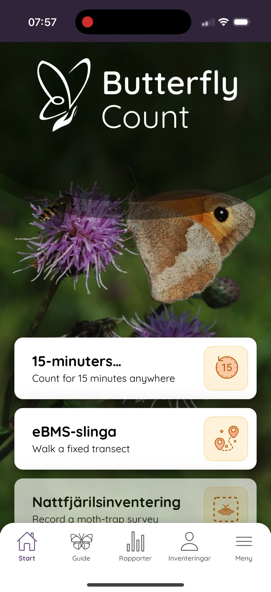
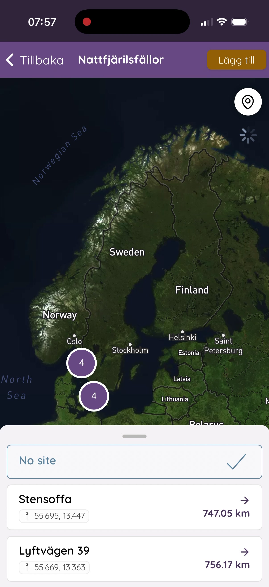
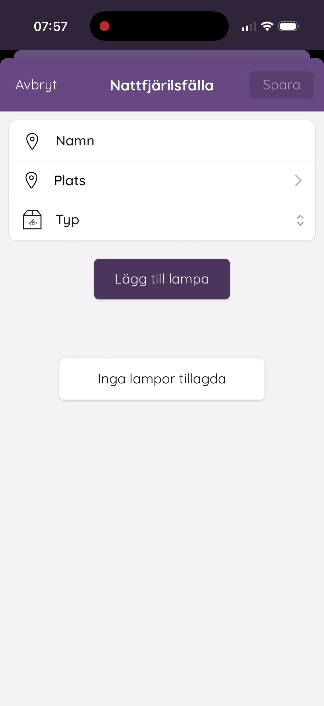
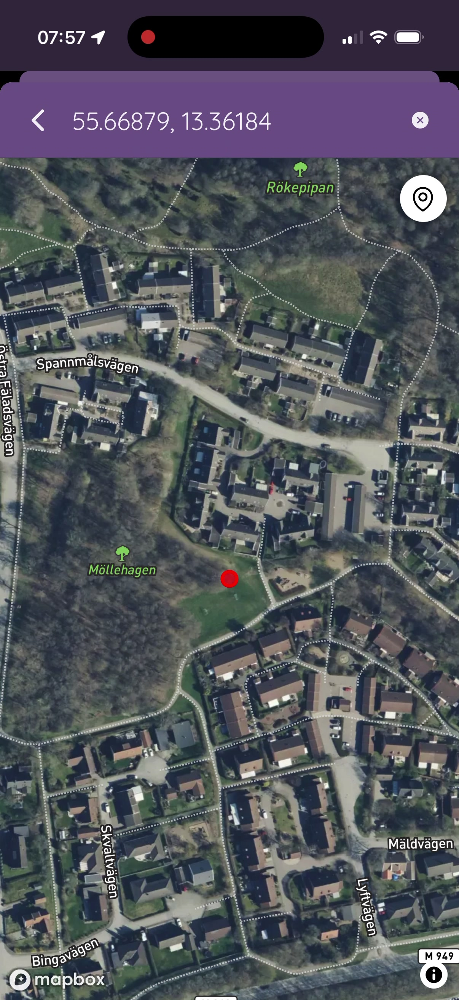
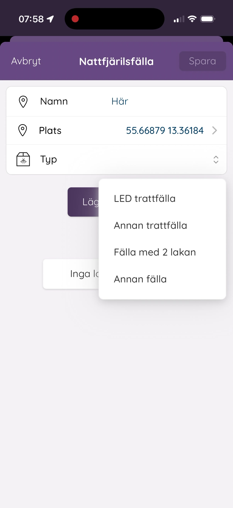
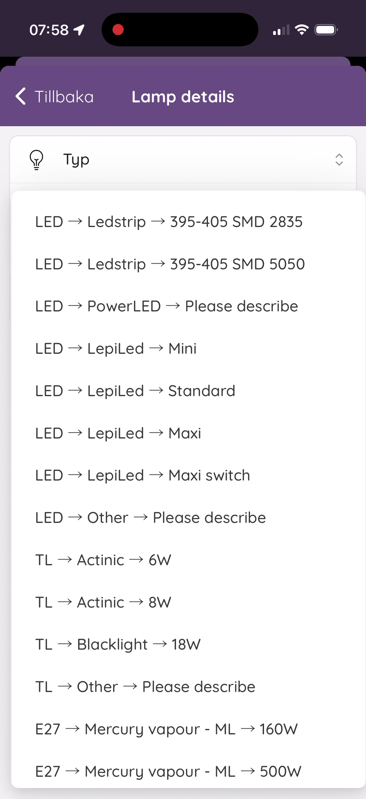
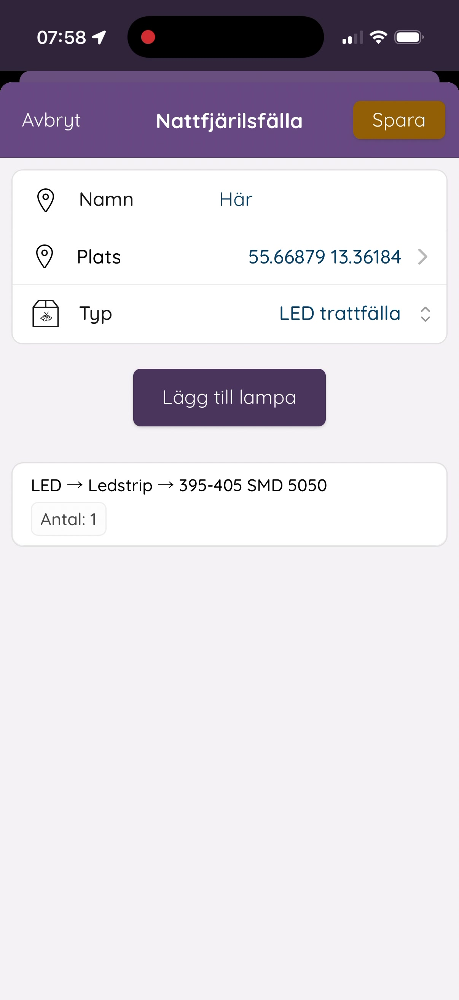
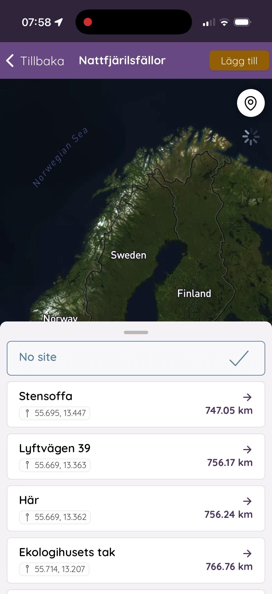

# Registrera fälla

Innan du kan börja rapportera nattfjärilar behöver du dels installera appen ButterflyCount, dels registrera din fälla och lokal. Det görs bara en gång per fälla, antingen via webben eller direkt i appen.

## 1. Installera appen ButterflyCount

Ladda ner appen där du brukar hämta hem appar:

- [GooglePlay](https://play.google.com/store/apps/details?id=uk.ac.ceh.ebms&hl=sv&gl=US)
- [AppStore](https://apps.apple.com/ie/app/ebms/id1461711373)

Öppna appen och välj **Språk** och **Land**.

Skapa en användare: gå till **Meny**, fyll i namn och lösenord, läs och acceptera användarvillkoren.

## 2. Ställ in nattfjärilsräkning som standard

Gå till:

**Meny → App → Primary Survey → Moth Survey (SPRING)**

## 3. Ladda ner artlistor

Under samma inställningar, ladda ner artlistorna **Sweden** och **EBMS moths**.

## 4. Registrera din fälla

Du kan registrera fällan antingen via webben eller direkt i appen.

### Via webben

Gå till [butterfly-monitoring.net/ebms-app](https://butterfly-monitoring.net/ebms-app).

1. Logga in med samma inloggningsuppgifter som i appen.
2. Gå till **Mina data → Mina nattfjärilsfällor → Lägg till en lokal**.
3. Fyll i **Land**, **Namn på lokal** och **Plats** (tryck på kartan).
4. Välj typ av fälla: **LED Funnel trap**.
5. Under **Types of lamp in trap**, se namngivning nedan.
6. Tryck **Skicka**.

### Direkt i appen

Här är en filmad genomgång av hela registreringsprocessen:

  <iframe
    src="https://www.youtube.com/embed/w4kJjqw5moU?cc_load_policy=0"
    title="Registrera lokal i ButterflyCount | Pilotprojekt nattfjärilar 2026"
    frameborder="0"
    allow="accelerometer; autoplay; clipboard-write; encrypted-media; gyroscope; picture-in-picture"
    allowfullscreen>
  </iframe>

Steg för steg:

**Steg 1.** Välj **Nattfjärilsinventering** på startsidan. Om du ser ett meddelande om ett sparat utkast, tryck **Start new**.

<figure class="app-figure">
  
  <figcaption>Startsidan — välj Nattfjärilsinventering</figcaption>
</figure>

**Steg 2.** Du kommer till **Inventeringsdetaljer** — tryck på **Nattfjärilsfälla** längst upp. I listan som öppnas, tryck **Lägg till** i övre högra hörnet.

<figure class="app-figure">
  
  <figcaption>Nattfjärilsfällor — tryck Lägg till</figcaption>
</figure>

**Steg 3.** Fyll i **Namn** på din fälla, t.ex. lokalens namn och fällnummer (**Ängen 1**).

<figure class="app-figure">
  
  <figcaption>Nytt fällaformulär — fyll i Namn, Plats och Typ</figcaption>
</figure>

**Steg 4.** Tryck på **Plats** — en karta öppnas. Navigera till din lokal och tryck för att markera platsen.

<figure class="app-figure">
  
  <figcaption>Karta — markera fällans position och bekräfta koordinaterna</figcaption>
</figure>

**Steg 5.** Tryck på **Typ** och välj **LED trattfälla**.

<figure class="app-figure">
  
  <figcaption>Typ — välj LED trattfälla</figcaption>
</figure>

**Steg 6.** Tryck **Lägg till lampa** — tryck sedan på **Typ** och välj rätt ljuskälla för din fällmodell (se namngivning nedan). Tryck tillbaka.

<figure class="app-figure">
  
  <figcaption>Lamp details — välj rätt ljuskälla för din fällmodell</figcaption>
</figure>

**Steg 7.** Kontrollera att lampan syns i listan och tryck **Spara**.

<figure class="app-figure">
  
  <figcaption>Formuläret komplett med ljuskälla listad — tryck Spara</figcaption>
</figure>

**Steg 8.** Fällan dyker nu upp i listan **Nattfjärilsfällor** och är redo att användas.

<figure class="app-figure">
  
  <figcaption>Nattfjärilsfällor — den nya fällan visas i listan</figcaption>
</figure>

### Namngivning

Om du har flera fällor på samma lokal måste varje fälla registreras separat, till exempel **Ängen 1**, **Ängen 2**, **Ängen 3**.

För gradientprojektets fyra fälltyper, ange ljuskälla så här vid registrering (se [Fälltyper](../falltyper/oversikt.md) för fullständiga specifikationer):

| Fälltyp | Ljuskälla |
|---|---|
| LED-Emmer (standard) | `LED > Ledstrip > 395-405 SMD 2835` |
| LED-Emmer 2.0 Quad | `LED > Other > "395-405 Quad"` |
| EntoLight Twincolor | `LED > Other > "Entolight Twincolor"` |
| EntoLight Multicolor | `LED > Other > "Entolight Multicolor"` |

Veldshop-varianten som används i rutnätsdelen registreras som **LED-Emmer (standard)** med samma ljuskälla (`LED > Ledstrip > 395-405 SMD 2835`) eftersom UV-specifikationen är identisk.

### Viktigt: undvik "training mode"

Registrera dig **inte** i training mode, varken i appen eller på hemsidan. Observationerna kommer in i systemet, men du kommer inte kunna ändra dem i efterhand.

## Nästa steg

När fällan är registrerad, se [Så använder du appen](app-instrux.md) för hur du rapporterar en tömning.

---

*Stötte du på ett tekniskt fel vid registreringen som inte nämns här? Se [Rapportera ett tekniskt fel](../kontakt-och-stod/rapportera-tekniskt-fel.md) för hur du går vidare.*
