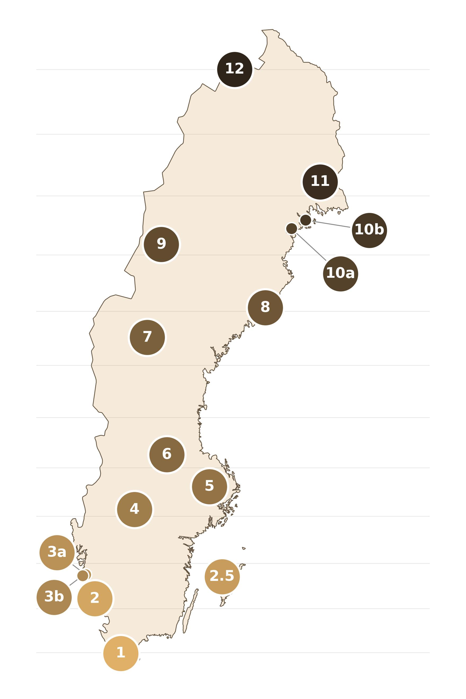

# Gradient (Lund-Abisko)

Gradientdelen är pilotprojektets huvudkomponent: 15 lokaler längs ett nordsydligt stråk från Lund till Abisko, med fyra olika fälltyper (se [Fälltyper](../falltyper/oversikt.md)) testade parallellt på varje lokal.

## Vad gäller för dig som är med i gradientdelen

- Se [Allmänna principer för fällplatsval och lottning](site-specifikationer.md) för hur fällorna placeras och tilldelades din lokal
- Provtagning sker **en gång i veckan** — se [Veckorutin](../under-experimentet/vecko-rutin.md) för när du ska börja och praktiska detaljer, inklusive eventuella uppehåll under ljusa nätter vid nordliga lokaler
- Alla fyra fälltyper ska registreras separat i appen/på hemsidan, se [Registrera fälla](../hur-du-rapporterar/registrera-falla.md)

## Lokalerna

De 12 kärnlokalerna är fördelade längs gradienten med ungefär lika stort avstånd i breddgrad. Till dessa kommer tre kompletterande lokaler med specifika syften:

| Nr | Lokal | Anmärkning |
|---|---|---|
| 1 | Revinge | |
| 2 | Varberg | |
| 2.5 | Gotlands Tofta | Ö-lokal (se nedan) |
| 3a | Torslanda | |
| 3b | Grötö | Ö-lokal (se nedan) |
| 4 | Kristinehamn | |
| 5 | Uppsala | |
| 6 | Falun | |
| 7 | Torråsen | |
| 8 | Umeå | |
| 9 | Marsfjäll | Ljusuppehåll sommaren (se nedan) |
| 10a | Norrfjärden | NAT-PoMS-jämförelse; ljusuppehåll (se nedan) |
| 10b | Luleå | Ljusuppehåll sommaren (se nedan) |
| 11 | Överkalix | Ljusuppehåll sommaren (se nedan) |
| 12 | Abisko | Ljusuppehåll sommaren (se nedan) |

### De tre kompletterande lokalerna

**Gotlands Tofta (2.5) och Grötö (3b)** representerar öhabitat. Öar innebär särskilda förutsättningar för nattfjärilar: begränsade populationer, möjliga isoleringseffekter och ett mikroklimat som skiljer sig från fastlandet. Inte minst kan blåst vara en utmaning för att inventera med ljushinkar i kustmiljöer. Dessa lokaler låter oss undersöka hur väl fällorna fångar upp dessa skillnader.

**Norrfjärden (10a)** kopplar gradientprojektet till det nationella pilotförsöket NAT-PoMS som testade pollinatörsövervakning i olika delar av Sverige 2021–2022. Nattfjärilsdata i NAT-PoMS samlades in här under 2022. Resultaten från 2026 kommer möjliggöra en direkt jämförelse med resultaten från det arbetet — se Arnberg m.fl. (2024) [Pilotförsök för generell övervakning av pollinatörer](https://portal.research.lu.se/en/publications/pilotf%C3%B6rs%C3%B6k-f%C3%B6r-generell-%C3%B6vervakning-av-pollinat%C3%B6rer-resultat-f%C3%B6r-2/) och EU-projektet [SPRING](https://data.europa.eu/doi/10.2779/7978371).

## Varför denna gradient?

### Ljusbetingelser och breddgrad

Det primära skälet till att sträcka gradienten ända till Abisko är att undersöka hur ljusbetingelserna under sommaren påverkar fångstresultaten. Längre norrut förkortas sommarnatten snabbt — och vid tillräckligt höga breddgrader försvinner den astronomiska skymningen helt under en period mitt på sommaren. Ljusfällor fungerar helt enkelt inte när natten inte är tillräckligt mörk för att attrahera nattfjärilar.

Redan så långt söderut som Dalarna kan denna effekt bli märkbar under sommarnattens ljusaste delar. För projektets fem nordligaste lokaler (Marsfjäll och norröver) innebär det att flera av provtagningstillfällena blir frivilliga under en del av sommaren då beräknade ljusbetingelser ännu inte är bra nog för ljusfångst av nattfjärilar. Som komplement är man dock alltid välkommen att testa även tidigare än föreslaget förstadatum — alla data är välkomna!

### Fångsteffektivitet och arbetsbelastning

Det finns också en praktisk dimension. De fyra fällmodellerna skiljer sig åt i ljusstyrka och spektralsammansättning — de finska EntoLight-modellerna är kraftfulla och kan potentiellt locka till sig betydligt fler individer. I södra Sverige, med hög artrikedom och rikliga nattfjärilspopulationer, riskerar det att ge fler fjärilar per vittjning än vad som är rimligt att hantera ensam. 

Längre norrut, där säsongen är kortare och fångstmängderna generellt lägre, kan den extra kapaciteten vara välbehövlig. Gradienten gör det möjligt att testa detta i praktiken och bidra till att fastställa realistiska arbetsbelastningsgränser inför framtida nationell övervakning.

## Ljusuppehåll vid nordliga lokaler

Fem av projektets lokaler ligger tillräckligt norrut för att sommarnatten försvinner helt under en period. Under dessa veckor ska fällorna inte sättas ut. Tabellen nedan visar beräknade uppehållsperioder baserade på astronomisk skymning, kalibrerat mot fältobservationer från Norrfjärden (se [Beräkning av ljusuppehåll](ljusberakningar.md) för beräkningsmetod).

| Lokal | Fällorna stängs | Fällorna öppnar igen | Uppehåll |
|---|---|---|---|
| Marsfjäll (9) | 3 juni | 11 juli | 38 dagar |
| Norrfjärden (10a) | 1 juni | 13 juli | 42 dagar |
| Luleå (10b) | 30 maj | 15 juli | 46 dagar |
| Överkalix (11) | 26 maj | 19 juli | 54 dagar |
| Abisko (12) | 16 maj | 29 juli | 74 dagar |

Lokaler 1–8 (Revinge–Umeå) har inga ljusbegränsningar och kan provtas hela säsongen.

## Om urvalet

Med bara 15 lokaler totalt är varje lokals data viktig. Vi har haft som målsättning att fördela ut lokaler jämt över landets breddgrader plus komplettera med några ytterligare lokaler. Med så stort spann av breddgrader och så varierande naturtyper är den fasta placeringen av fällor på varje lokal viktig. 

Fyra platser för fällor väljs i förväg, alla så likvärdiga som möjligt. Vilken fälla som ska stå var lottas sedan. Upplägget där vi undersöker 15 platser med fast placering av fällor är centralt för studiedesignen — en omdisponering mitt i säsongen skulle underminera möjligheten att jämföra fälltyper rättvist (se [Allmänna principer](site-specifikationer.md)).
