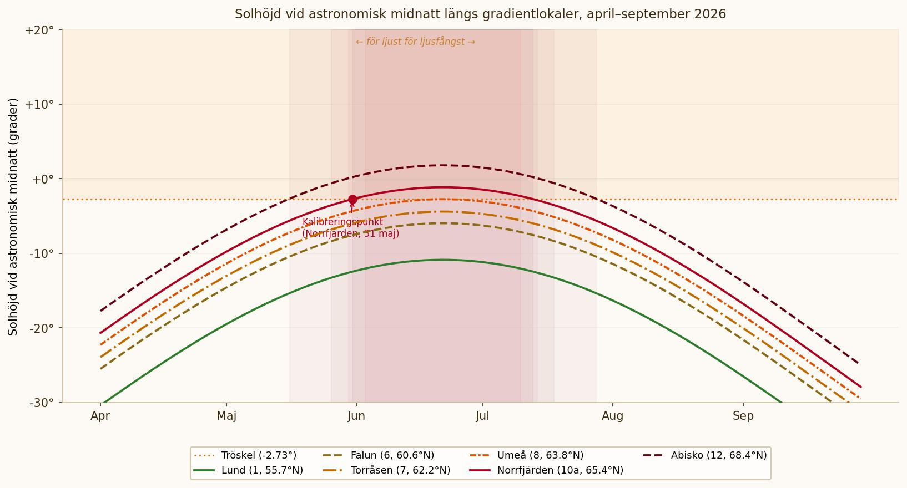

# Beräkning av ljusuppehåll

Den här sidan förklarar hur datumangivelserna för ljusuppehållen vid de nordligaste gradientlokalerna har beräknats. Den vänder sig till dig som vill förstå bakgrunden — det räcker att följa tabellen på [gradientsidan](gradient-lund-abisko.md) om du bara behöver veta när fällorna ska vara ute.

## Varför försvinner sommarnattens mörker?

Jorden är lutad 23,44° relativt sin omloppsbana runt solen. Den lutningen gör att solen vid midsommar aldrig går ned vid tillräckligt höga breddgrader — det som kallas midnattssolen. Exakt var gränsen går beror på vilket mörker man kräver: civil, nautisk eller astronomisk skymning, var och en med en definierad solhöjd under horisonten.

För ljusfällor handlar det inte om absolut mörker utan om att solens ljus inte ska störa fångsten. Det innebär att man behöver ta hänsyn till solhöjden vid astronomisk midnatt — den tidpunkt på dygnet då solen är som lägst.

## Solhöjden vid astronomisk midnatt

Solens position kan beräknas med två faktorer: **solens deklination** (δ), som beskriver hur långt solen befinner sig norr eller söder om ekvatorplanet under årets gång, och **breddgraden** (φ) för den plats man vill beräkna för.

Deklinationen varierar sinusformigt under året, med maximum +23,44° vid midsommar och minimum -23,44° vid midvinter:

> δ = −23,44° × cos(2π(N + 10) / 365)

där N är årets dag (1 = 1 januari).

Solhöjden vid astronomisk midnatt beräknas sedan som:

> h = δ + φ − 90°

När h är negativt befinner sig solen under horisonten. Ju mer negativ h är, desto mörkare är natten. Vid h = 0° sker midnattssolen (solen precis vid horisonten vid midnatt).

## Kalibreringen mot fältobservationer

En rent astronomisk tröskel — exempelvis nautisk skymning vid h = −12° — stämmer inte nödvändigtvis med hur nattfjärilar faktiskt beter sig i ljusfällor. Beräkningarna i det här projektet är i stället kalibrerade mot fältobservationer.

En av projektets deltagare genomförde ljusfångst vid **Norrfjärden (65,42°N)** under ett antal säsonger och rapporterade att fällorna fungerade väl till och med den 31 maj, men att natten inte var mörk nog att ge meningsfulla resultat under perioden runt midsommar. Den 31 maj ger vid Norrfjärdens breddgrad ett beräknat h-värde på **−2,73°**, vilket har använts som tröskel för projektet.

Det bör noteras att tröskelvärdet innehåller en osäkerhet: observatörens erfarenhet är att fällorna *inte fungerade* från en viss tidpunkt, men exakt var gränsen går för meningsfull fångst kan variera mellan lokaler och fälltyper. Se avsnittet om osäkerhet nedan.

## Diagram

Figuren nedan visar solhöjden vid astronomisk midnatt för ett urval av projektets lokaler under april–september 2026. Kurvor som stiger över tröskeln (orange prickad linje) markerar perioder då fångst inte rekommenderas.

Lokaler söder om ungefär 65°N — från Lund till Umeå — håller sig under tröskeln under hela säsongen och kan provtas oavbrutet. För de fem nordligaste lokalerna passeras tröskeln runt midsommar.

## Beräknade uppehållsperioder för projektets lokaler

Tabellen nedan visar de beräknade uppehållsperioderna baserat på det kalibrerade tröskelvärdet h = −2,73°. Angivna datum avser när kurvan för respektive lokal passerar tröskeln.

| Lokal | Breddgrad | Fällorna stängs | Fällorna öppnar | Uppehåll |
|---|---|---|---|---|
| Marsfjäll (9) | 65,10°N | 3 juni | 11 juli | 38 dagar |
| Norrfjärden (10a) | 65,42°N | 1 juni | 13 juli | 42 dagar |
| Luleå (10b) | 65,58°N | 30 maj | 15 juli | 46 dagar |
| Överkalix (11) | 66,40°N | 26 maj | 19 juli | 54 dagar |
| Abisko (12) | 68,36°N | 16 maj | 29 juli | 74 dagar |

Lokaler 1–8 (Revinge–Umeå, upp till 63,82°N) har inga beräknade uppehåll och kan provtas hela säsongen.

## Osäkerhet och begränsningar

**Asymmetri i kalibreringen.** De ursprungliga fältobservationerna antydde att fällorna slutade fungera runt 31 maj och återupptogs runt 1 augusti. De två datumen ger inte exakt samma tröskelvärde — 31 maj ger h = −2,73°, medan 1 augusti ger ett något lägre värde (~−6,7°). Skillnaden beror sannolikt på att fällorna inte testades aktivt i perioden närmast midsommar, utan att frånvaron av data tolkades som att de inte fungerade. Det konservativare värdet (31 maj, h = −2,73°) har valts, vilket ger kortare uppehållsperioder snarare än längre.

**Lokala variationer.** Molntäcke, topografi och lokalt ljusföroreningar kan förskjuta gränsen för meningsfull fångst i båda riktningarna. Beräkningarna avser astronomiska förutsättningar, inte faktiska väderbetingelser.

**Uppmuntran att testa.** Observationerna från norra lokaler kring uppehållets gränsdatum är välkomna och värdefulla, även om resultaten kan vara begränsade. Alla data bidrar till att förbättra kalibreringen inför framtida säsonger.

## Externa resurser

För den som vill utforska solens rörelser mer i detalj rekommenderas:

- [SMHI:s Soluret](https://www.smhi.se/kunskapsbanken/meteorologi/sol-och-mane/soluret-1.3798) — information om soluppgång och solnedgång i Sverige
- [timeanddate.com](https://www.timeanddate.com/sun/sweden/) — interaktiv solkalkylator med exakta tider för valfri plats och datum
- [Astronomisk almanacka, Lund Observatory](https://www.astro.lu.se/) — Lunds observatorium publicerar astronomisk referensdata

---

*Beräkningarna på den här sidan kan reproduceras med den sinusoidala soldeklarationsmodellen ovan. För högre precision kan paket som [PyEphem](https://rhodesmill.org/pyephem/) (Python) användas, vilket tar hänsyn till fulla ephemerider och atmosfärisk refraktion.*
