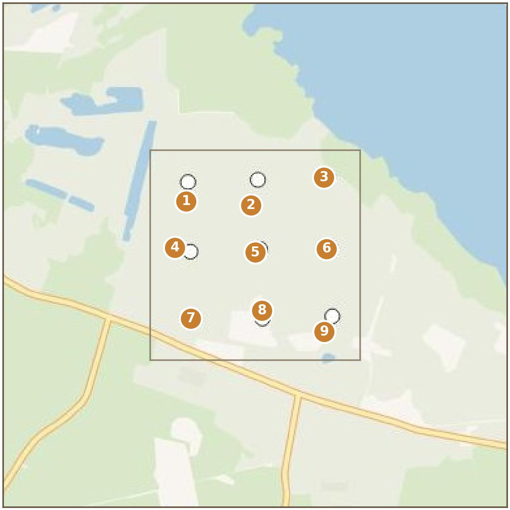
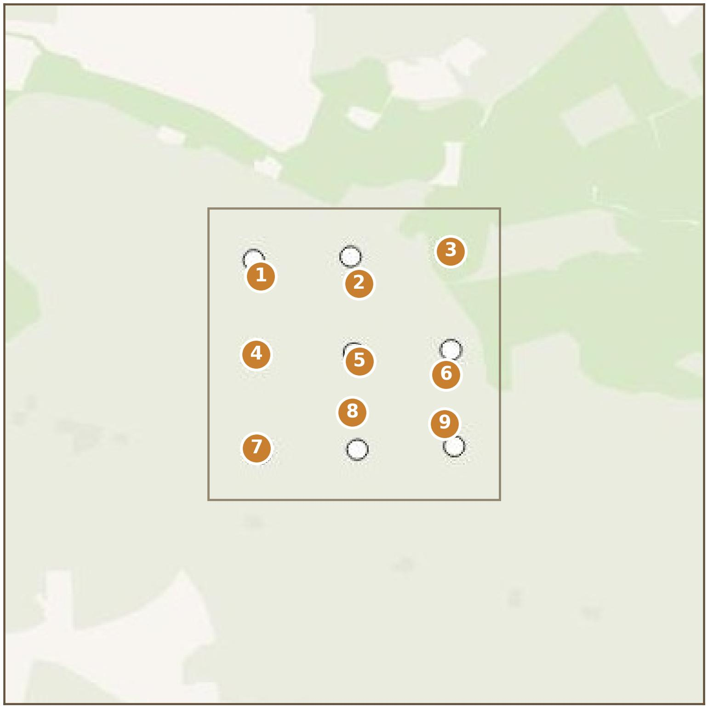
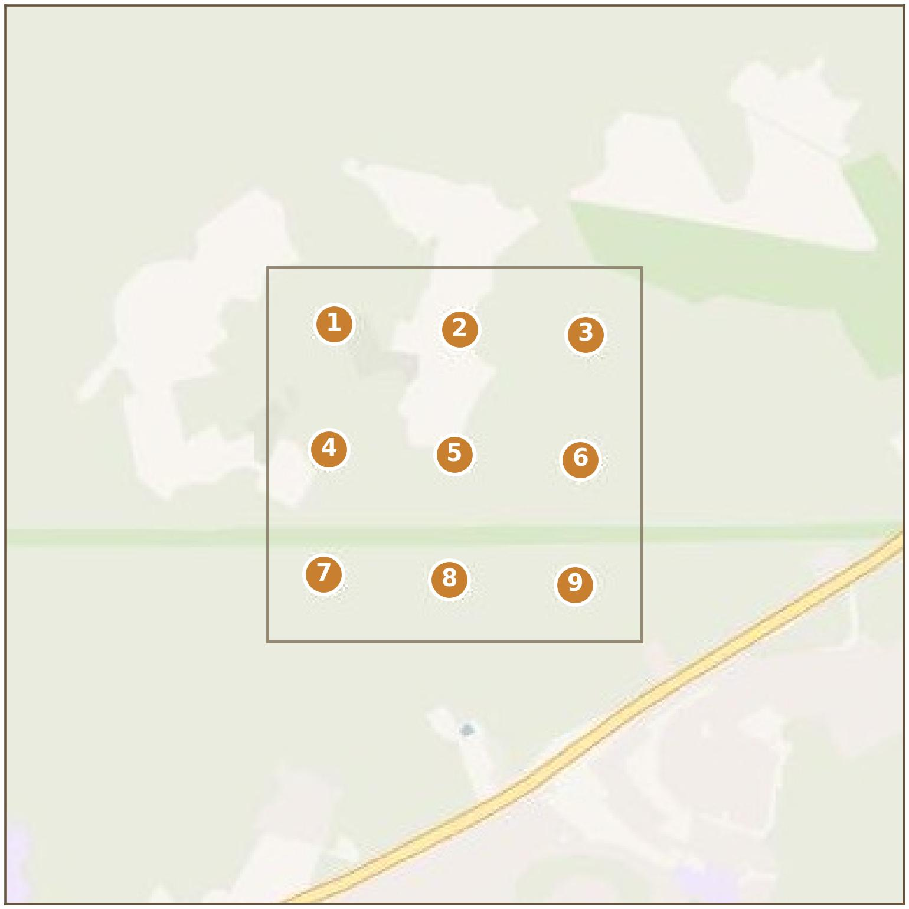
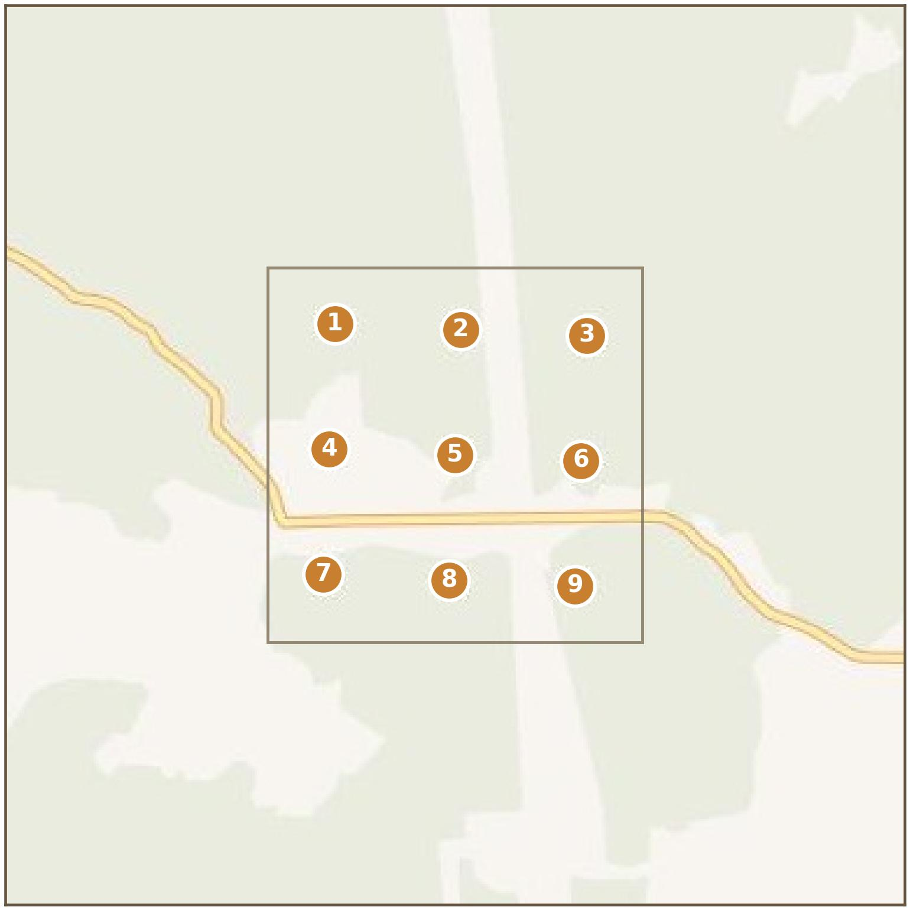

# Rutnät (Lund och Uppsala)

Försöket utförs i Lund och i Uppsala. På vardera lokalen placeras 2 stycken 3×3 rutnät med ljushinksfällor för nattfjärilar, alltså två separata rutnät per ort.

## Fällorna

Rutnätsdelen använder fälltypen **LED-Emmer standardmodell 2.0** från Veldshop. I praktiken är denna fälla identisk med Vlinderstichtings standardmodell av **LED-Emmer** (samma UV-specifikation, se [Fälltyper](../falltyper/oversikt.md)) som används i gradientförsöket, men den saknar ljussensor och har små konstruktionsskillnader mot Vlinderstichting-modellen i tratt-, lock- och ljusmodulform. Ljusmodulens vingar är anpassade för att passa till just den här tratten.

Eftersom UV-specifikationen är identisk med **LED-Emmer standard** registreras denna fälltyp som **LED-Emmer (standard)** i appen eller på hemsidan (`Ledstrip > 395-405 SMD 2835`, se [Fälltyper](../falltyper/oversikt.md)).

## Registrering

Se [Registrera fälla](../hur-du-rapporterar/registrera-falla.md), samma tillvägagångssätt som för gradientdelen men med endast en fälltyp att hålla reda på.

## Praktiskt

Varje rutnät har 9 fällpositioner, numrerade 1–9 med 1 i nordvästra hörnet och därefter radvis mot sydost (samma ordning som på kartorna nedan).

### Lund: Silvåkra

*[TBD: vägbeskrivning, parkering, ev. markägarkontakt.]*

### Lund: Björnstorp

*[TBD: vägbeskrivning, parkering, ev. markägarkontakt.]*

### Uppsala, lokal A (preliminär plats)

**Observera**: positionerna på den här kartan är en preliminär planeringsgrund, inte de faktiskt registrerade platserna. Kartan uppdateras när de riktiga positionerna är på plats.

### Uppsala, lokal B (preliminär plats)

**Observera**: positionerna på den här kartan är en preliminär planeringsgrund, inte de faktiskt registrerade platserna. Kartan uppdateras när de riktiga positionerna är på plats.

---

*[TBD: vittjningsschema, ev. avvikelser mot standardprotokollet.]*
