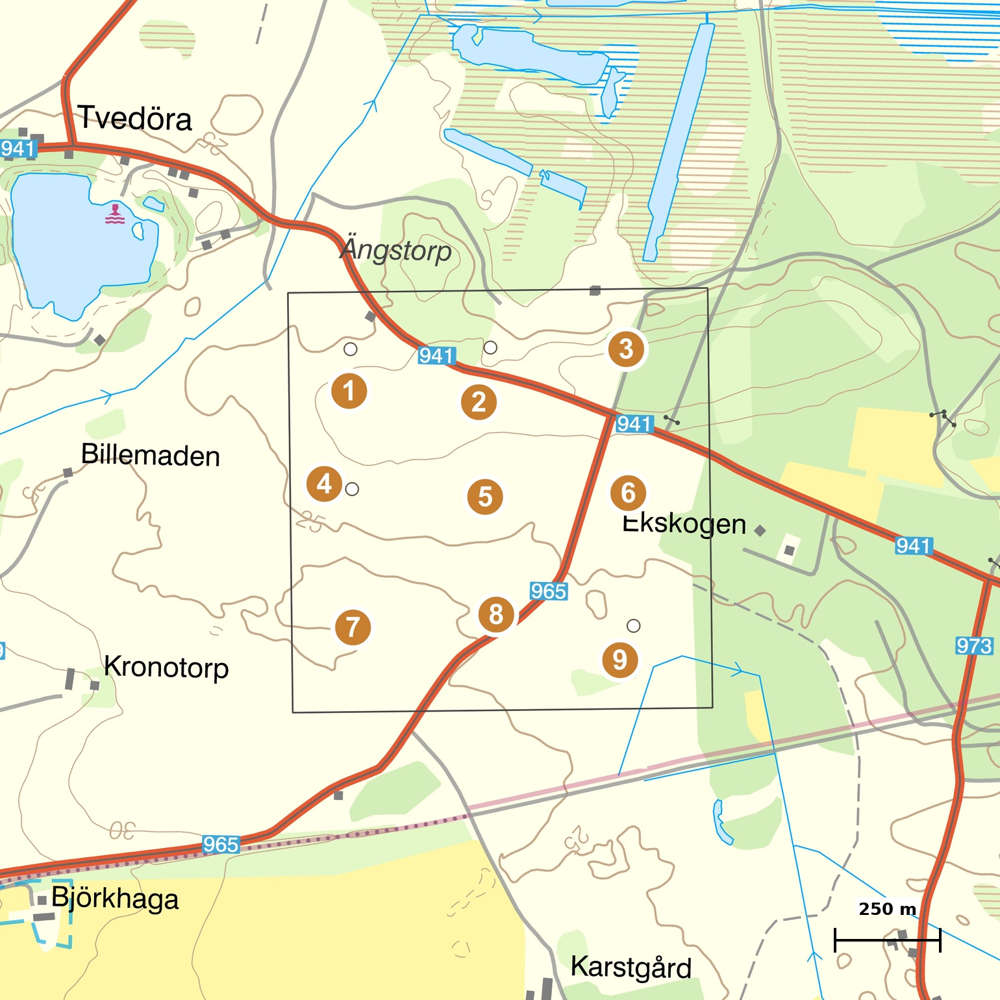
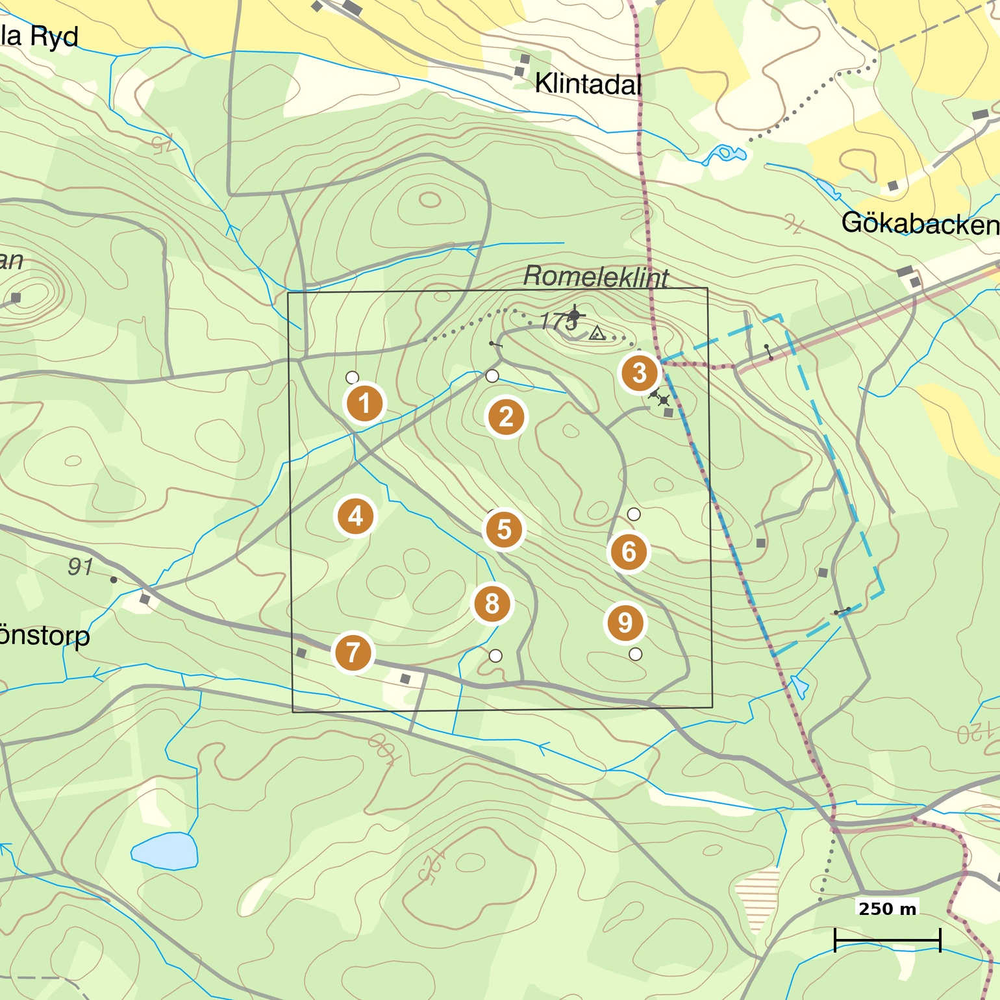
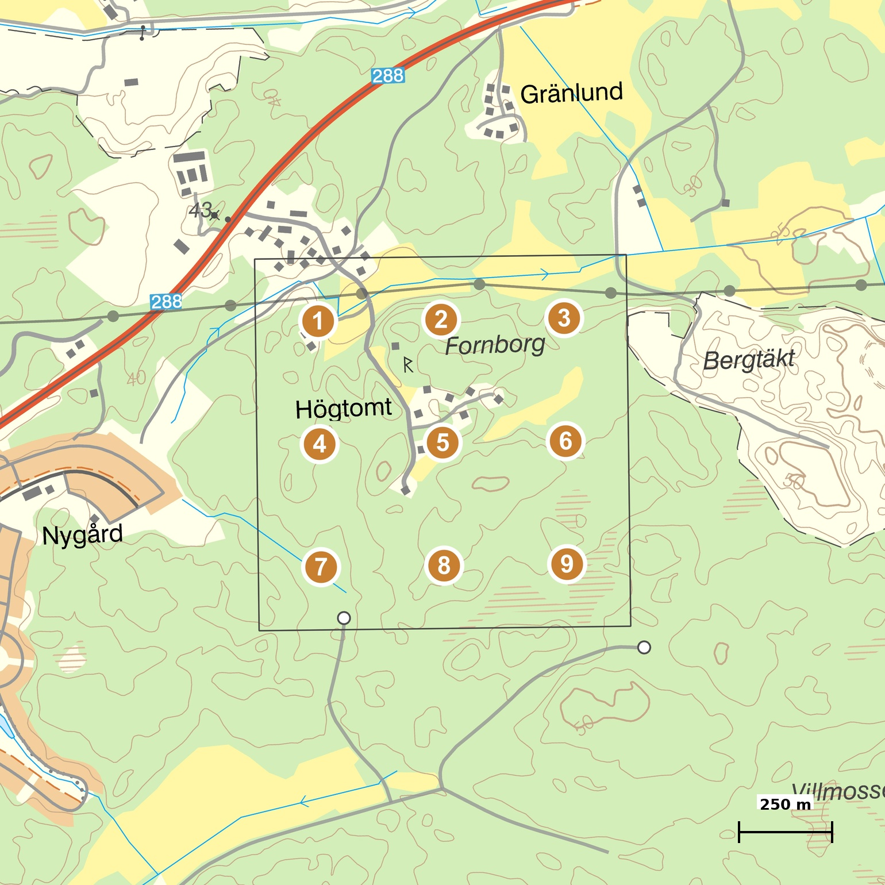
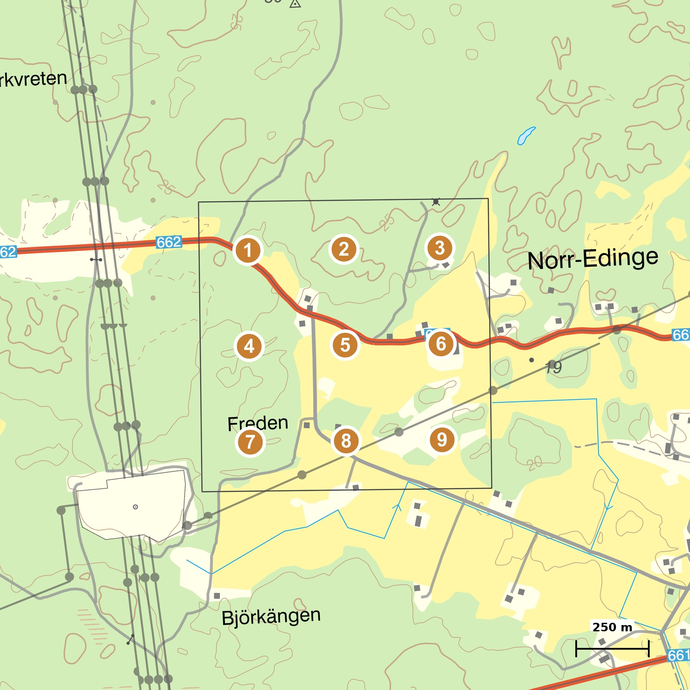

# Rutnät (Lund och Uppsala)

Försöket utförs i Lund och i Uppsala. På vardera lokalen placeras 2 stycken 3×3 rutnät med ljushinksfällor för nattfjärilar, alltså två separata rutnät per ort.

## Fällorna

Rutnätsdelen använder fälltypen **LED-Emmer standardmodell 2.0** från Veldshop. I praktiken är denna fälla identisk med Vlinderstichtings standardmodell av **LED-Emmer** (samma UV-specifikation, se [Fälltyper](../falltyper/oversikt.md)) som används i gradientförsöket, men den saknar ljussensor och har små konstruktionsskillnader mot Vlinderstichting-modellen i tratt-, lock- och ljusmodulform. Ljusmodulens vingar är anpassade för att passa till just den här tratten.

Eftersom UV-specifikationen är identisk med **LED-Emmer standard** registreras denna fälltyp som **LED-Emmer (standard)** i appen eller på hemsidan (`Ledstrip > 395-405 SMD 2835`, se [Fälltyper](../falltyper/oversikt.md)).

## Registrering

Se [Registrera fälla](../hur-du-rapporterar/registrera-falla.md), samma tillvägagångssätt som för gradientdelen men med endast en fälltyp att hålla reda på.

## Markägarkontakter

För Skåne går kontakter med markägaren via [lars.pettersson@biol.lu.se](mailto:lars.pettersson@biol.lu.se) och för Uppland via [anders.glimskar@slu.se](mailto:anders.glimskar@slu.se).

## Lokaler

Varje rutnät har 9 fällpositioner, numrerade 1–9 med 1 i nordvästra hörnet och därefter radvis mot sydost. Kartorna nedan visar rutnätets mönster och den typ av landskap fällorna står i, men den geografiska placeringen är medvetet förskjuten av säkerhetsskäl (för att inte röja de faktiska fällornas exakta plats) och visar alltså inte den verkliga platsen.

### Skåne A

### Skåne B

### Uppland A

### Uppland B

