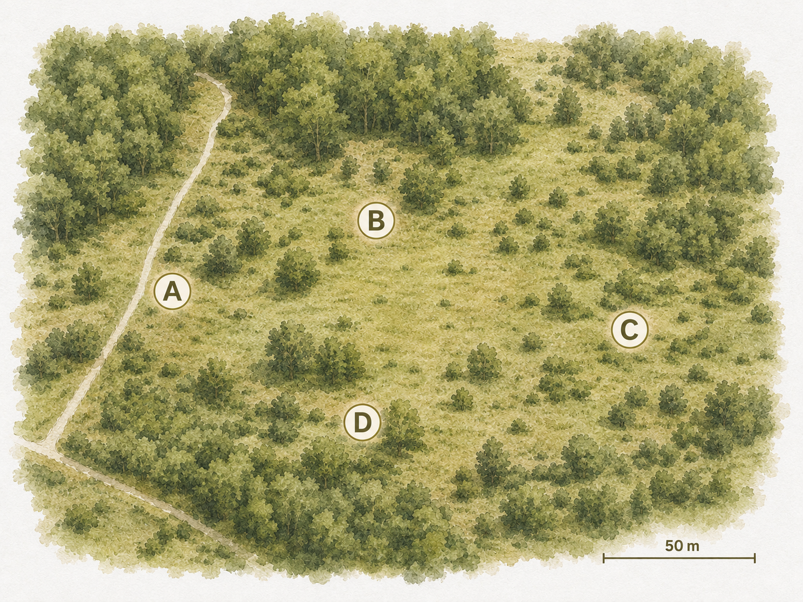
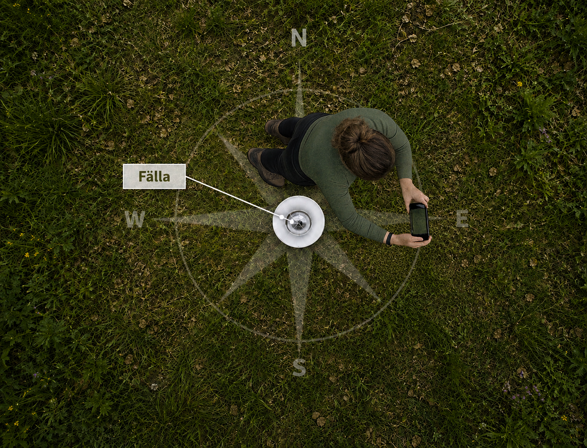
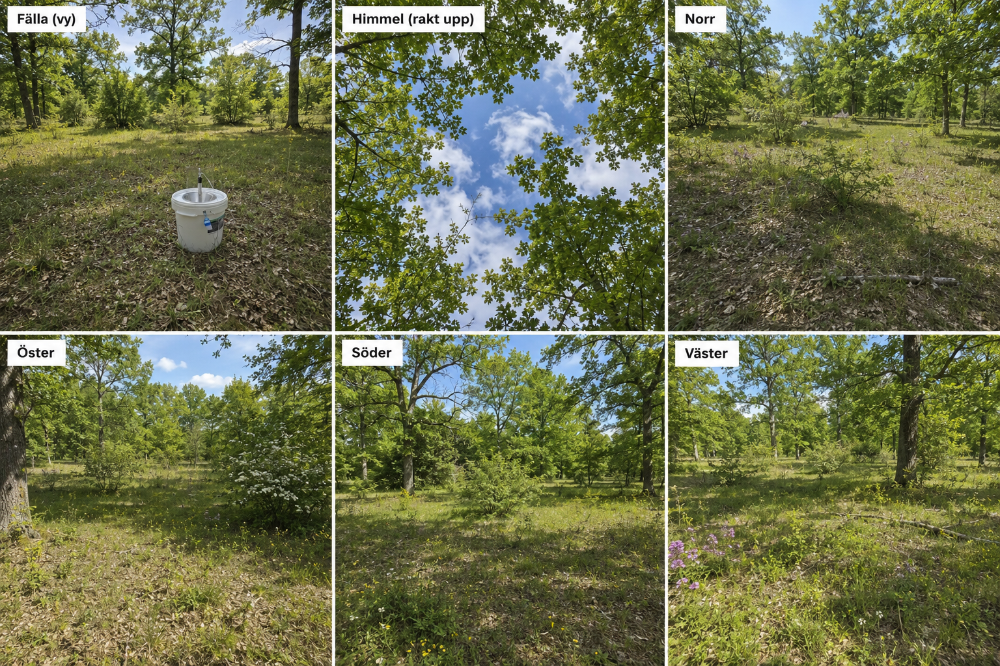
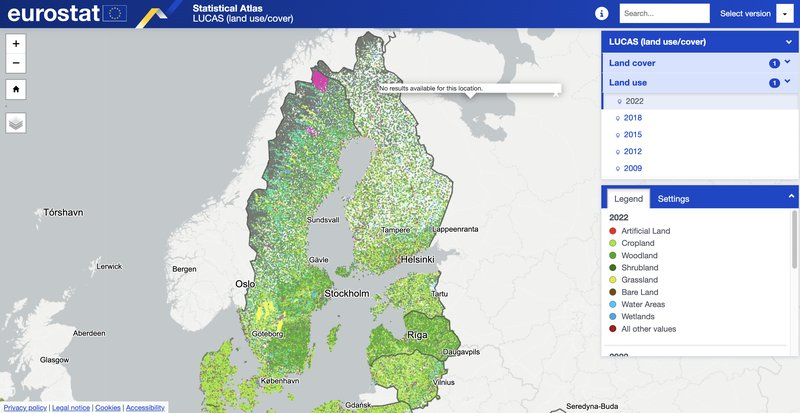

# Sätta ut fällor: allmänna principer

Det här gäller för gradientdelen av projektet (se [Rutnät](rutnat-lund-uppsala.md) för den delen).

## Val av fällplatser

På din lokal väljer du ut **4 fällplatser**:

- Så lika varandra som möjligt: antingen samma habitat (t.ex. alla i barrskog) eller en liknande blandning av habitat på alla fyra platser
- Helst minst **50 meter** mellan varje fälla
- Alla platser ska vara "så lika varandra och så bra som möjligt" utifrån din bedömning. Tanken är att ingen av platserna ska vara bättre än de andra och att platsen i sig inte ska påverka ljusfällans effektivitet 

## Lottning av fälltyp

När platserna är valda, dra lott om vilken av de fyra fälltyperna (se [Fälltyper](../falltyper/oversikt.md)) som ska stå på vilken plats.

**Viktigt**: den tilldelningen gäller sedan för hela säsongen. Det är avgörande för studiedesignen att fälltyperna inte byts mellan platserna under experimentets gång, även om det kan vara frestande att testa en annan fälla på en annan plats. Du är fri att experimentera med fällorna när du inte kör den ordinarie veckovisa provtagningen, men själva försöksomgångarna måste använda de fasta positionerna.

## Dokumentation av lokal

Under **en avgränsad kampanj i augusti 2026** (exakta datum meddelas) dokumenterar vi varje fällplats med ett standardiserat fotouppsättning. Dokumentationen görs en gång och behöver inte upprepas om inte lokalen förändras dramatiskt.

Upplägget är anpassat från [LUCAS — Land Use/Cover Area frame Survey](https://ec.europa.eu/eurostat/statistics-explained/index.php?title=Glossary:Land_use/cover_area_frame_survey_(LUCAS)), EU:s standardiserade marktäckeinventering. [LUCAS-metodiken](https://ec.europa.eu/eurostat/statistics-explained/index.php?title=LUCAS_-_Land_use_and_land_cover_survey#:~:text=of%20landscape%20fragmentation.-,The%20LUCAS%20survey,by%20surveyors%20on%20the%20ground.) föreskriver ett liknande fotouppsättning vid varje provpunkt för att möjliggöra systematiska jämförelser av miljöer.

### Hur du tar bilderna

Håll telefonen i **liggande läge (landscape)** för alla riktningsbilder. Sikta så att ungefär **en sjättedel av bilden är himmel** — det vill säga horisonten ska vara relativt nära bildens överkant. Använd kompassfunktionen i telefonen för att hitta rätt riktning.

Ta följande **sex bilder vid varje fällplats**:

| Bild | Motiv | Instruktion |
|---|---|---|
| 1 | Fällan från sidan | Ca 5 m avstånd, fällan centrerad i bild |
| 2 | Rakt upp (krontäckning) | Håll telefonen horisontellt med linsen rakt upp mot himlen |
| 3 | Norrut | Stå vid fällan, vänd mot norr, ca 1/6 himmel |
| 4 | Österut | Stå vid fällan, vänd mot öster, ca 1/6 himmel |
| 5 | Söderut | Stå vid fällan, vänd mot söder, ca 1/6 himmel |
| 6 | Västerut | Stå vid fällan, vänd mot väster, ca 1/6 himmel |

Koordinaterna för varje fällplats hämtas automatiskt ur appen vid registrering och behöver inte noteras separat (se [Registrera fälla](../hur-du-rapporterar/registrera-falla.md)).

Nyfiken på vad den här typen av foton kan visa på landskapsnivå? [LUCAS Statistical Atlas](https://ec.europa.eu/eurostat/statistical-atlas/?config=LUCAS) ger en interaktiv bild av markdata och marktäcke över hela EU.

