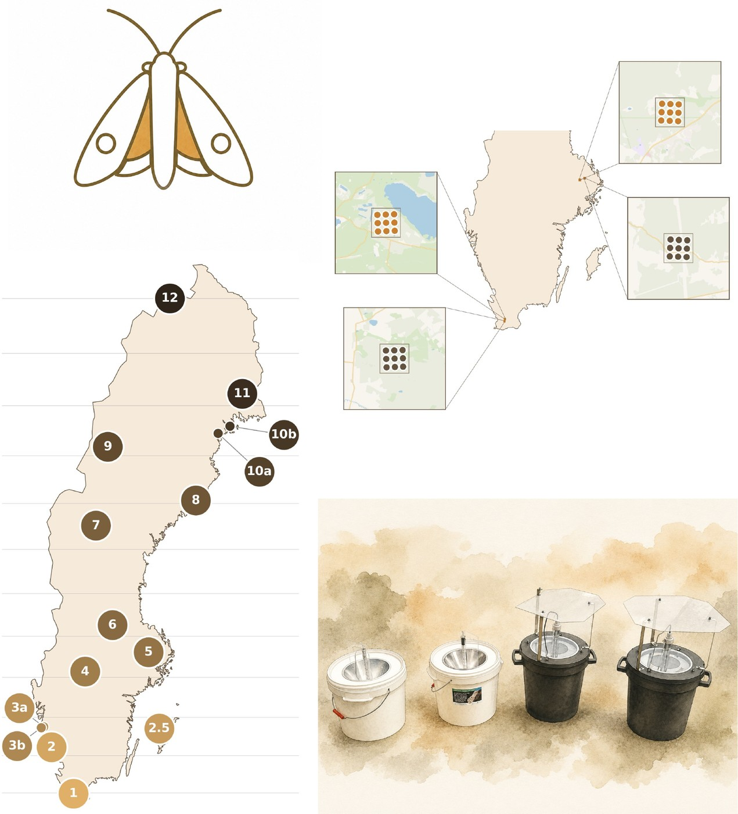

Välkommen till manualen för 2026 års pilotprojekt. Den här sidan visar dig var du hittar det du behöver, beroende på vilken del av projektet du deltar i.

## Varför gör vi detta?

Nattfjärilar är viktiga pollinatörer, men vi vet förvånansvärt lite om hur deras populationer mår över tid. Nu ska EU:s medlemsländer börja övervaka fyra olika pollinatörsgrupper regelbundet, och nattfjärilar är en av dem. Innan Sverige kan sätta igång på allvar behöver vi svara på några praktiska frågor: vilken typ av fälla fungerar bäst? Hur starkt ljus behövs? Var i landskapet bör fällorna stå? Det är precis det som det här pilotprojektet ska ta reda på under 2026, inför att övervakningen ska börja skarpt från 2027. 

Läs mer om projektet i [Bakgrund](bakgrund/oversikt.md), inklusive varför vi använder de här digitala verktygen.

## Vilken del av projektet är du med i?

- **Landskapseffekter (Lund/Uppsala)**: du sköter rutnät med 3 x 3 levandefällor för nattfjärilar, s.k. ljushinkar, i 1 x 1 km landskapsrutor. Fällorna är den holländska standardmodellen LED-Emmer fast i version 2.0 från Veldshop. Gå till [Sätta ut fällor: rutnät](hur-du-satter-ut/rutnat-lund-uppsala.md).
- **Latitudgradient (Lund-Abisko)**: du sköter en av de 15 gradientlokalerna som var och en testar fyra olika fällmodeller som alla är varianter på den traditionella ljushinksdesignen,   provtagning med fällorna en gång i veckan. Gå till [Sätta ut fällor: gradient](hur-du-satter-ut/gradient-lund-abisko.md).

Se även [Allmänna principer för fällplatsval och lottning](hur-du-satter-ut/site-specifikationer.md) och [Fälltyper](falltyper/oversikt.md).

## Under säsongen

När du är igång, se [Veckorutin: sätta ut, tömma, rapportera](under-experimentet/vecko-rutin.md) för det löpande arbetet.

## Hur du rapporterar

- [Registrera fälla](hur-du-rapporterar/registrera-falla.md)
- [Så använder du appen](hur-du-rapporterar/app-instrux.md)
- [Vad som ska rapporteras](hur-du-rapporterar/vad-som-raknas.md)
- [Ändra observationer i efterhand](hur-du-rapporterar/andra-observationer.md)

## Efter inrapportering

- [Validering](efter-inrapportering/validering.md)
- [Vad blir det av din data?](efter-inrapportering/forvantade-resultat.md)

## Samtycke: delning av kontaktuppgifter

Vi kommer dels att skicka ut info via nyhetsbrev och e-post, om du inte vill att din epost-adress ska synas där så hör bara av dig till nattflyn@gmail.com. För att kunna ge möjlighet till snabbt utbyte av erfarenheter  och hjälp med support kommer vi även ha en WhatsApp-grupp men deltagande där är frivilligt. Dina kontaktuppgifter kan alltså komma att delas med andra deltagare i projektet via dessa två kanaler men e-posten kan anonymiseras och WhatsApp-gruppen är frivillig.

## Kontakt och stöd

Frågor om metod, placering eller liknande, se [Kontakt och stöd](kontakt-och-stod/whatsapp-och-kontakt.md).

---

**Aktuell version**: v0.3.0 (2026-07-24) · Den här manualen uppdateras löpande, se även [Nyheter och senaste lärdomarna](kontakt-och-stod/nyheter.md) · För en översikt av manualen, se [Alla sidor](alla-sidor.md).
